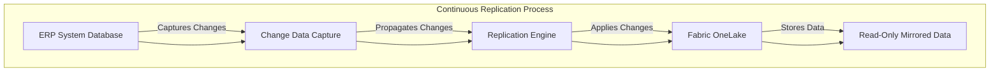
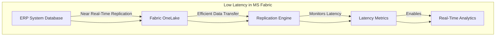
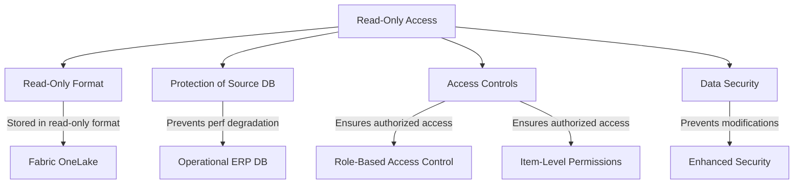

# Mirroring ERP into Fabric: Performance Analysis 

Costa Rica

[brown9804](https://github.com/brown9804)

Last updated: 2025-02-28

----------

> Quick technical overview of Mirroring an ERP System Database into Microsoft Fabric

<b>List of References</b> (Click to expand)

- [What is Mirroring in Fabric?](https://learn.microsoft.com/en-us/fabric/database/mirrored-database/overview)
- [Mirroring Fabric SQL database in Microsoft Fabric (preview)](https://learn.microsoft.com/en-us/fabric/database/sql/mirroring-overview)
- [Open mirroring in Microsoft Fabric (Preview)](https://learn.microsoft.com/en-us/fabric/database/mirrored-database/open-mirroring)
- [Latency in Activator](https://learn.microsoft.com/en-us/fabric/real-time-intelligence/data-activator/activator-latency)
- [Permission model](https://learn.microsoft.com/en-us/fabric/security/permission-model)
- [Secure data access in Microsoft Fabric](https://learn.microsoft.com/en-us/training/modules/secure-data-access-in-fabric/)
- [Authorization in SQL database in Microsoft Fabric](https://learn.microsoft.com/en-us/fabric/database/sql/authorization)

<b>Table of Content</b> (Click to expand)

## Overview 

| **Purpose and Benefits** | **Description** |
|--------------------------|-----------------|
| **Continuous Replication** | Microsoft Fabric continuously replicates data from your ERP system database into Fabric's OneLake. |
| **Low Latency** | The replication process is designed to be low-latency, ensuring near real-time data availability for analytics. |
| **Read-Only Access** | The mirrored data is stored in a read-only format, protecting the operational ERP database from performance degradation due to analytics queries. |

### Continuous Replication

- **Replication Mechanism:** Microsoft Fabric uses a continuous data replication mechanism to mirror data from your ERP system database into Fabric's OneLake. This process involves capturing changes in the source database and applying them to the mirrored database in near real-time.
- **Change Data Capture (CDC):** The replication process leverages Change Data Capture (CDC) technology to track changes (inserts, updates, deletes) in the source ERP database. These changes are then propagated to the mirrored database in Fabric.
- **Data Consistency:** The replication ensures data consistency between the source ERP database and the mirrored database in Fabric. Any changes made in the source database are reflected in the mirrored database almost immediately.
- **Scalability:** The replication process is designed to handle large volumes of data, making it suitable for enterprise-scale ERP systems.

### Low Latency

- **Near Real-Time Replication:** The replication process is optimized for low latency, ensuring that data changes in the source ERP database are mirrored in Fabric's OneLake with minimal delay.
- **Efficient Data Transfer:** The replication engine uses efficient data transfer protocols to minimize latency. This includes batching changes and using optimized network paths to transfer data quickly.
- **Latency Metrics:** Microsoft Fabric provides tools to monitor replication latency, allowing administrators to ensure that the replication process meets the required performance standards.
- **Real-Time Analytics:** The low-latency replication enables real-time analytics on the mirrored data, allowing businesses to make timely decisions based on the most current data.

### Read-Only Access

- **Read-Only Format:** The mirrored data in Fabric's OneLake is stored in a read-only format, which means that it cannot be modified directly by users or applications.
- **Protection of Source Database:** By providing read-only access to the mirrored data, the operational ERP database is protected from performance degradation caused by analytics queries.
- **Access Controls:** Microsoft Fabric implements robust access controls to ensure that only authorized users can access the mirrored data. This includes role-based access control (RBAC) and item-level permissions.
- **Data Security:** The read-only nature of the mirrored data also enhances security by preventing accidental or malicious modifications to the data.

  <h3 style="color: #4CAF50;">Total Visitors</h3>
  

