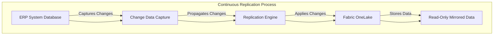
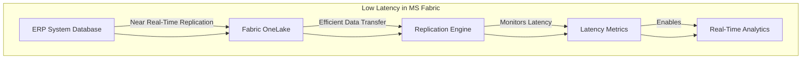
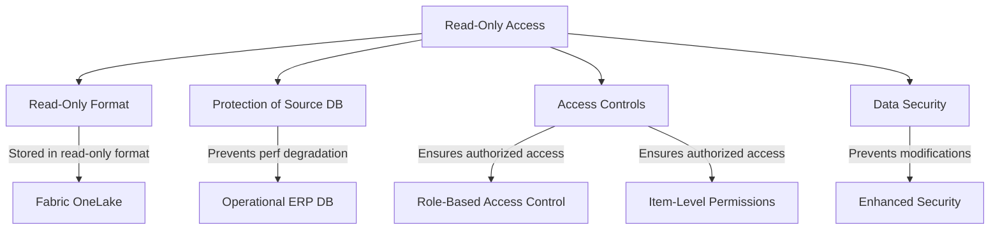
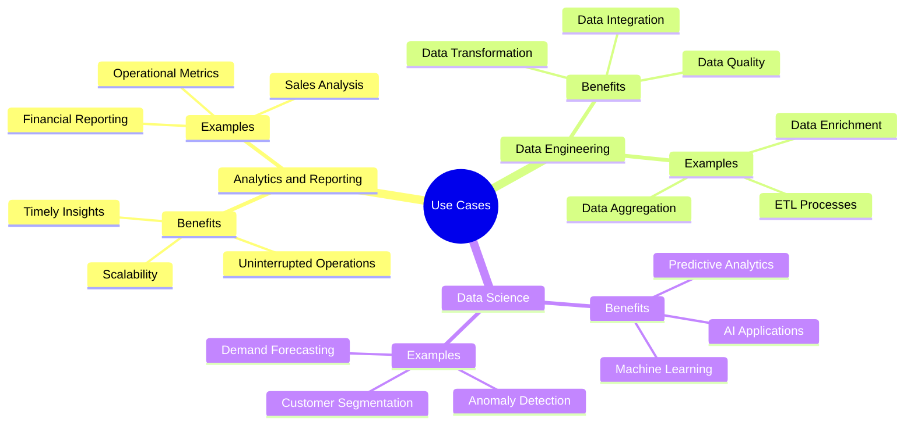
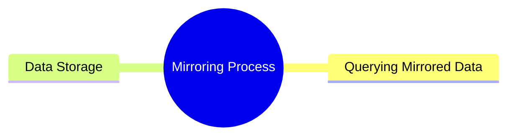
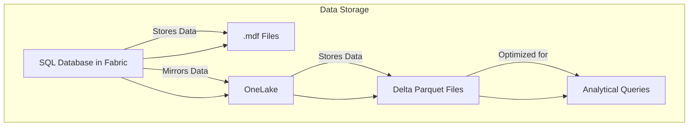
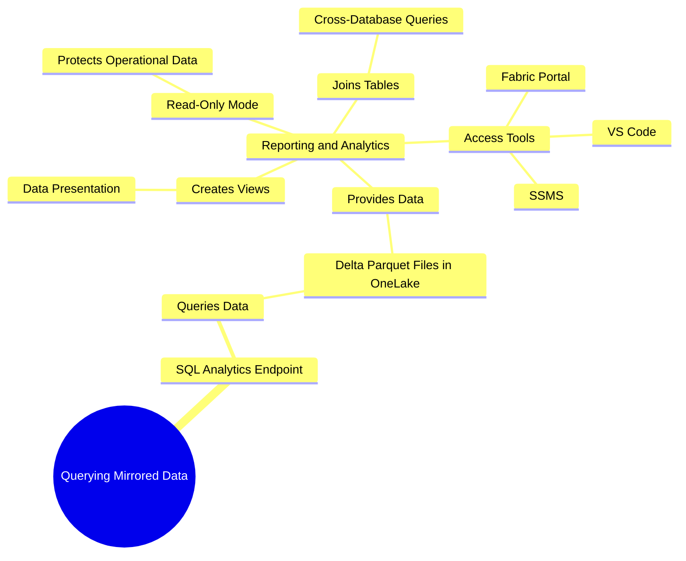

# Mirroring ERP into Fabric: Performance Analysis 

Costa Rica

[brown9804](https://github.com/brown9804)

Last updated: 2025-07-17

----------

> Quick technical overview of Mirroring an ERP System Database into Microsoft Fabric

> [!NOTE]
> `Shortcuts` in Microsoft Fabric are objects that point to other storage locations, either within OneLake or external sources like Azure Data Lake, Amazon S3, and Dataverse. They provide `real-time access` to data without physically copying it, reducing storage overhead and ensuring the latest data is always available.  
> `Mirroring` in Microsoft Fabric involves creating a synchronized copy of an external database within OneLake. This process `physically stores` the data in Fabric, enabling faster query performance and ensuring data consistency through continuous updates.

<b>List of References</b> (Click to expand)

- [What is Mirroring in Fabric?](https://learn.microsoft.com/en-us/fabric/database/mirrored-database/overview)
- [Mirroring Fabric SQL database in Microsoft Fabric (preview)](https://learn.microsoft.com/en-us/fabric/database/sql/mirroring-overview)
- [Open mirroring in Microsoft Fabric (Preview)](https://learn.microsoft.com/en-us/fabric/database/mirrored-database/open-mirroring)
- [Latency in Activator](https://learn.microsoft.com/en-us/fabric/real-time-intelligence/data-activator/activator-latency)
- [Permission model](https://learn.microsoft.com/en-us/fabric/security/permission-model)
- [Secure data access in Microsoft Fabric](https://learn.microsoft.com/en-us/training/modules/secure-data-access-in-fabric/)
- [Authorization in SQL database in Microsoft Fabric](https://learn.microsoft.com/en-us/fabric/database/sql/authorization)
- [What is the SQL analytics endpoint for a lakehouse? - Microsoft Fabric](https://learn.microsoft.com/en-us/fabric/data-engineering/lakehouse-sql-analytics-endpoint)
- [Query the SQL analytics endpoint of your SQL database in Fabric](https://learn.microsoft.com/en-us/fabric/database/sql/query-sql-analytics-endpoint)
- [SQL database Overview (Preview) - Microsoft Fabric](https://learn.microsoft.com/en-us/fabric/database/sql/overview)
  

<b>Table of Content</b> (Click to expand)

## Overview 

| **Purpose and Benefits** | **Description** |
|--------------------------|-----------------|
| **Continuous Replication** | Microsoft Fabric continuously replicates data from your ERP system database into Fabric's OneLake. |
| **Low Latency** | The replication process is designed to be low-latency, ensuring near real-time data availability for analytics. |
| **Read-Only Access** | The mirrored data is stored in a read-only format, protecting the operational ERP database from performance degradation due to analytics queries. |
| **Use Cases** | - **Analytics and Reporting:** Perform analytics and generate reports without impacting the operational ERP database.   - **Data Engineering:** Use the mirrored data for data engineering tasks, such as data transformation and integration.   - **Data Science:** Leverage the mirrored data for data science projects, including machine learning and AI. |

### Continuous Replication

- **Replication Mechanism:** Microsoft Fabric uses a continuous data replication mechanism to mirror data from your ERP system database into Fabric's OneLake. This process involves capturing changes in the source database and applying them to the mirrored database in near real-time.
- **Change Data Capture (CDC):** The replication process leverages Change Data Capture (CDC) technology to track changes (inserts, updates, deletes) in the source ERP database. These changes are then propagated to the mirrored database in Fabric.
- **Data Consistency:** The replication ensures data consistency between the source ERP database and the mirrored database in Fabric. Any changes made in the source database are reflected in the mirrored database almost immediately.
- **Scalability:** The replication process is designed to handle large volumes of data, making it suitable for enterprise-scale ERP systems.

### Low Latency

- **Near Real-Time Replication:** The replication process is optimized for low latency, ensuring that data changes in the source ERP database are mirrored in Fabric's OneLake with minimal delay.
- **Efficient Data Transfer:** The replication engine uses efficient data transfer protocols to minimize latency. This includes batching changes and using optimized network paths to transfer data quickly.
- **Latency Metrics:** Microsoft Fabric provides tools to monitor replication latency, allowing administrators to ensure that the replication process meets the required performance standards.
- **Real-Time Analytics:** The low-latency replication enables real-time analytics on the mirrored data, allowing businesses to make timely decisions based on the most current data.

### Read-Only Access

- **Read-Only Format:** The mirrored data in Fabric's OneLake is stored in a read-only format, which means that it cannot be modified directly by users or applications.
- **Protection of Source Database:** By providing read-only access to the mirrored data, the operational ERP database is protected from performance degradation caused by analytics queries.
- **Access Controls:** Microsoft Fabric implements robust access controls to ensure that only authorized users can access the mirrored data. This includes role-based access control (RBAC) and item-level permissions.
- **Data Security:** The read-only nature of the mirrored data also enhances security by preventing accidental or malicious modifications to the data.

### Use Cases

#### Analytics and Reporting

> The primary goal is to enable business users and analysts to perform data analysis and generate reports without affecting the performance of the operational ERP database.

**Benefits:**
- **Uninterrupted Operations:** Since the mirrored data is read-only, analytics queries do not interfere with the day-to-day operations of the ERP system.
- **Timely Insights:** Near real-time replication ensures that the data used for analytics is up-to-date, allowing for timely and accurate decision-making.
- **Scalability:** The system can handle large volumes of data, making it suitable for enterprises with extensive reporting needs.

> Examples:

| **Example** | **Description** |
|-------------|-----------------|
| **Financial Reporting** | Generate financial statements, balance sheets, and profit & loss reports. |
| **Sales Analysis** | Analyze sales trends, customer behavior, and product performance. |
| **Operational Metrics** | Monitor key performance indicators (KPIs) such as inventory levels, order fulfillment rates, and production efficiency. |

#### Data Engineering

> To facilitate data transformation, integration, and preparation tasks that are essential for building data pipelines and workflows.

> Benefits:
  - **Data Transformation:** Convert raw data into a structured format suitable for analysis and reporting.
  - **Data Integration:** Combine data from multiple sources, including the ERP system, to create a unified data repository.
  - **Data Quality:** Implement data cleansing and validation processes to ensure the accuracy and reliability of the data.

> Examples:

| **Example** | **Description** |
|-------------|-----------------|
| **ETL Processes** | Extract, transform, and load data from the ERP system into a data warehouse or data lake. |
| **Data Enrichment** | Enhance the ERP data with additional information from external sources, such as market data or customer feedback. |
| **Data Aggregation** | Summarize and aggregate data to create high-level views and dashboards. |

#### **Data Science:**
- **Purpose:** To leverage the mirrored data for advanced analytics, machine learning, and artificial intelligence projects.
> Benefits:
  - **Predictive Analytics:** Use historical data to build models that predict future trends and outcomes.
  - **Machine Learning:** Train machine learning models on the mirrored data to automate decision-making processes and improve business operations.
  - **AI Applications:** Develop AI-driven applications that can provide insights, recommendations, and automation.

> Examples:

| **Example** | **Description** |
|-------------|-----------------|
| **Customer Segmentation** | Use clustering algorithms to segment customers based on their behavior and preferences. |
| **Demand Forecasting** | Predict future demand for products and services using time series analysis. |
| **Anomaly Detection** | Identify unusual patterns or outliers in the data that may indicate fraud, errors, or opportunities. |

## Mirroring Process

### Data Storage

- **Mirrored Data Storage:** The mirrored data is stored as delta parquet files in OneLake. Parquet is a columnar storage file format optimized for analytical queries, providing efficient data compression and encoding schemes.
- **Delta Format:** The delta format supports ACID transactions and allows for efficient data updates and deletions. This ensures that the mirrored data remains consistent and reliable.
- **Storage Management:** OneLake provides a unified storage solution that integrates with various Fabric services, such as Spark, Power BI, and data engineering tools. This integration allows for seamless data management and analytics.

### Querying Mirrored Data

- **SQL Analytics Endpoint:** The SQL Analytics Endpoint provides a SQL-based experience for querying mirrored data stored as delta parquet files in OneLake. It allows you to run reporting and analytics queries without impacting the primary workload of the operational ERP database.
- **Read-Only Mode:** The endpoint operates in read-only mode, ensuring that analytics queries do not modify the mirrored data. This protects the integrity of the operational data and prevents any performance degradation.
- **Creating Views:** You can create views in your SQL analytics endpoint to shape the data presentation. Views allow you to define how the data should be displayed and can include complex joins, aggregations, and calculations.
- **Joining Tables:** The SQL analytics endpoint supports joining mirrored tables with other tables in different warehouses or lakehouses in the workspace. This enables you to perform cross-database queries and integrate data from multiple sources for comprehensive analysis.
- **Access and Querying Tools:** You can access the SQL Analytics Endpoint through various tools such as SQL Server Management Studio, Visual Studio Code, and the Fabric portal. It supports T-SQL language, allowing you to create views, save functions, and apply SQL security.

<!-- START BADGE -->

  
  
Refresh Date: 2025-10-23

<!-- END BADGE -->

