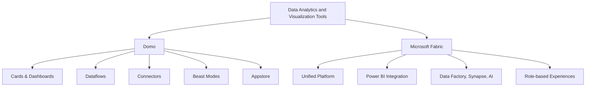

# From Domo to Microsoft Fabric - Overview

Costa Rica

[brown9804](https://github.com/brown9804)

Last updated: 2025-06-24

------------------------------------------

<b>List of References</b> (Click to expand)

- [Microsoft Fabric documentation](https://learn.microsoft.com/en-us/fabric/)
- [Domo Official Site](https://www.domo.com/)
- [Dataflows in Microsoft Fabric](https://learn.microsoft.com/en-us/power-bi/transform-model/dataflows/dataflows-introduction-self-service)
- [Time intelligence functions (DAX)](https://learn.microsoft.com/en-us/dax/time-intelligence-functions-dax)
- [Star schema guidance](https://learn.microsoft.com/en-us/power-bi/guidance/star-schema)
- [Conditional formatting in Power BI](https://learn.microsoft.com/en-us/power-bi/create-reports/desktop-conditional-table-formatting)
- [Optimization guide for Power BI](https://learn.microsoft.com/en-us/power-bi/guidance/power-bi-optimization)
- [Power BI sharing and collaboration](https://learn.microsoft.com/en-us/power-bi/collaborate-share/service-share-dashboards)

<b>Table of Contents</b> (Click to expand)

- [Overview](#overview)
- [Migration Considerations](#migration-considerations)
- [Lifecycle Comparison](#lifecycle-comparison)
- [Data Ingestion](#data-ingestion)
    - [Essentials for Developers](#essentials-for-developers)
    - [Data Connection Types](#data-connection-types)
- [Data Transformation](#data-transformation)
- [Data Modelling](#data-modelling)
- [How to create visualizations](#how-to-create-visualizations)
    - [Recreate Simple Visuals](#recreate-simple-visuals)
    - [Custom Visuals](#custom-visuals)
    - [Bookmarks and Interactivity](#bookmarks-and-interactivity)
- [Optimization](#optimization)
- [Sharing Platform](#sharing-platform)
- [Admin](#admin)
- [Governance](#governance)
- [Migration Approach](#migration-approach)
    - [How to migrate a report](#how-to-migrate-a-report)
    - [Migrate End Users](#migrate-end-users)

## Overview

<b>Data Visualization</b> – Click to expand

> Domo uses cards, dashboards, and stories for visualizations. Microsoft Fabric leverages Power BI for advanced, interactive, and customizable visuals.

- **Benefits:** Power BI supports rich interactivity, custom visuals, and AI-driven insights. 
- **Differentiators:** Power BI integrates with DAX, Copilot, and supports embedding in apps and portals. 
- **Use Cases:** Executive dashboards, operational reporting, embedded analytics. 
- **Related Tools:** Power BI Desktop, Power BI Service, Visuals Marketplace. 

<b>Dashboards</b> – Click to expand

> Domo provides a drag-and-drop dashboard builder. Fabric offers a unified reporting and dashboard experience through Power BI.

- **Benefits:** Power BI dashboards aggregate visuals from multiple reports and datasets. 
- **Differentiators:** Supports live tiles, cross-report pinning, and integration with Teams and SharePoint. 
- **Use Cases:** Real-time monitoring, cross-functional reporting, executive summaries. 
- **Related Tools:** Power BI Apps, Power BI Service, Microsoft Teams. 

<b>Data Connectivity</b> – Click to expand

> Domo supports 1000+ connectors and Workbench. Fabric uses Azure Data Factory, Synapse, and Power Query for scalable, enterprise-grade connectivity.

- **Benefits:** Enables hybrid data access, real-time ingestion, and lakehouse integration. 
- **Differentiators:** Native support for Direct Lake, Delta Lake, and Parquet formats. 
- **Use Cases:** ETL/ELT pipelines, streaming data, hybrid cloud access. 
- **Related Tools:** Azure Data Factory, Power Query, Synapse Pipelines, OneLake. 

<b>Ease of Use</b> – Click to expand

> Domo emphasizes ease with Magic ETL and Appstore. Fabric offers a SaaS model with low-code/no-code experiences via Power Query.

- **Benefits:** Power Query provides a familiar, Excel-like interface for data transformation. 
- **Differentiators:** Unified UX across roles, reusable queries, and parameterization. 
- **Use Cases:** Self-service data prep, rapid prototyping, business user reporting. 
- **Related Tools:** Power Query Editor, Dataflows, Power BI Desktop. 

<b>Advanced Analytics</b> – Click to expand

> Domo includes Beast Modes and AI/ML apps. Fabric integrates built-in AI, DAX, Python/R, and Copilot for advanced analytics.

- **Benefits:** Supports predictive modeling, natural language queries, and embedded AI insights. 
- **Differentiators:** Copilot enables natural language report creation and data exploration. 
- **Use Cases:** Forecasting, anomaly detection, NLP-driven insights, data science collaboration. 
- **Related Tools:** Power BI Copilot, Azure ML, Python/R scripts, DAX Studio. 

<b>Unified Platform</b> – Click to expand

> Domo focuses on business intelligence and apps. Fabric delivers end-to-end analytics from ingestion to visualization in a single platform.

- **Benefits:** Reduces tool sprawl and improves governance and collaboration. 
- **Differentiators:** Combines Power BI, Synapse, Data Factory, and OneLake in one SaaS experience. 
- **Use Cases:** Enterprise data platforms, centralized analytics, cross-functional workflows. 
- **Related Tools:** Microsoft Fabric, OneLake, Synapse Data Warehouse, Data Factory. 

<b>Role-Specific Experiences</b> – Click to expand

> Domo supports business users, analysts, and data scientists. Fabric offers tailored experiences for engineers, scientists, and business users.

- **Benefits:** Each role gets a customized interface and toolset, from no-code to pro-code. 
- **Differentiators:** Fabric provides role-based hubs (e.g., Data Engineering, Data Science, BI) within a single platform. 
- **Use Cases:** Data engineering pipelines, BI reporting, data science notebooks, business dashboards. 
- **Related Tools:** Fabric Experiences (BI, Data Engineering, Data Science), Power BI, Notebooks, Pipelines. 

| Feature                | Domo                                                                 | Microsoft Fabric                                                                 |
|------------------------|----------------------------------------------------------------------|----------------------------------------------------------------------------------|
| **Data Visualization** | Cards, dashboards, and stories                                       | Power BI for advanced, interactive visualizations                                |
| **Dashboards**         | Drag-and-drop dashboard builder                                      | Unified reporting and dashboard experience                                       |
| **Data Connectivity**  | 1000+ connectors, Domo Workbench                                    | Azure Data Factory, Synapse, Power Query, and more                              |
| **Ease of Use**        | Intuitive UI, Appstore, Magic ETL                                   | SaaS model, low-code/no-code, Power Query                                       |
| **Advanced Analytics** | Beast Modes, Data Science tools, AI/ML apps                         | Built-in AI, DAX, Python/R integration, Copilot                                 |
| **Unified Platform**   | Focused on business intelligence and apps                           | End-to-end analytics: ingestion, transformation, modeling, visualization         |
| **Role-Specific**      | Business users, analysts, IT, data scientists                       | Tailored experiences for engineers, scientists, business users                   |

## Migration Considerations

<b>Data Ingestion</b> – Click to expand

> Domo uses connectors, Workbench, and Dataflows for ingestion. Microsoft Fabric supports ingestion via Data Factory, Power Query, Dataflows, and Direct Lake.

- **Benefits:** Fabric enables scalable, hybrid ingestion with support for real-time and batch pipelines. 
- **Differentiators:** Direct Lake allows high-performance access to data in OneLake without import or duplication. 
- **Use Cases:** Streaming data, hybrid cloud ingestion, enterprise ETL/ELT pipelines. 
- **Related Tools:** Azure Data Factory, Power Query, Synapse Pipelines, OneLake. 

<b>Data Modelling</b> – Click to expand

> Domo uses Dataflows, Joins, and Beast Modes. Fabric supports Dataflows, DAX, Star Schema, and Relationships for robust modeling.

- **Benefits:** Fabric promotes reusable, scalable models with semantic layers and time intelligence. 
- **Differentiators:** DAX enables complex calculations, and star schema improves performance and maintainability. 
- **Use Cases:** Enterprise semantic models, KPI dashboards, time-based analytics. 
- **Related Tools:** Power BI Desktop, DAX Studio, Dataflows, Tabular Editor. 

<b>Visualizations</b> – Click to expand

> Domo offers Cards, Stories, and Appstore Visuals. Fabric uses Power BI visuals, custom visuals, and themes for rich reporting.

- **Benefits:** Power BI supports interactive visuals, drillthrough, bookmarks, and custom themes. 
- **Differentiators:** Power BI Visuals Marketplace allows importing or developing custom visuals. 
- **Use Cases:** Executive dashboards, operational reports, embedded analytics. 
- **Related Tools:** Power BI Desktop, Visuals Marketplace, Report Builder. 

<b>Optimization</b> – Click to expand

> Domo uses DataFusions, Magic ETL, and DataSet Views. Fabric optimizes with query folding, aggregations, and Performance Analyzer.

- **Benefits:** Fabric enables performance tuning at the query and model level. 
- **Differentiators:** Query folding pushes transformations to the source, reducing load times. 
- **Use Cases:** Large datasets, complex models, performance-critical dashboards. 
- **Related Tools:** Performance Analyzer, DAX Studio, Power BI Optimizer. 

<b>Lifecycle</b> – Click to expand

> Domo follows a lifecycle of import, transform, visualize, and share. Fabric extends this with connect, transform, model, visualize, and share.

- **Benefits:** Fabric supports a more modular and governed lifecycle with reusable components. 
- **Differentiators:** Modeling is a distinct phase, enabling semantic consistency and reuse. 
- **Use Cases:** Enterprise BI workflows, governed self-service analytics. 
- **Related Tools:** Power BI Desktop, Dataflows, Deployment Pipelines. 

<b>Sharing & Collaboration</b> – Click to expand

> Domo uses Groups, Buzz, Appstore, and Publication Groups. Fabric enables collaboration via Workspaces, Apps, Power BI Service, and Teams.

- **Benefits:** Fabric integrates with Microsoft 365 for seamless sharing and collaboration. 
- **Differentiators:** Power BI Apps allow packaging and distributing reports across audiences. 
- **Use Cases:** Cross-team collaboration, secure sharing, embedded analytics. 
- **Related Tools:** Power BI Service, Microsoft Teams, SharePoint, OneDrive. 

<b>Licensing</b> – Click to expand

> Domo offers per user, per instance, and enterprise licensing. Fabric supports per user, Premium, and Fabric Capacity models.

- **Benefits:** Fabric offers flexible scaling with capacity-based pricing for enterprise workloads. 
- **Differentiators:** Fabric Capacity allows shared resources across services like Power BI, Synapse, and Data Factory. 
- **Use Cases:** Small teams to large enterprises, cost-optimized scaling. 
- **Related Tools:** Microsoft 365 Admin Center, Fabric Capacity Metrics App. 

<b>Governance & Admin</b> – Click to expand

> Domo provides Admin Center and Data Governance Toolkit. Fabric includes Admin Portal, Sensitivity Labels, and Compliance tools.

- **Benefits:** Fabric supports enterprise-grade governance with audit logs, data classification, and policy enforcement. 
- **Differentiators:** Integration with Microsoft Purview and Microsoft 365 compliance center. 
- **Use Cases:** Regulated industries, data protection, audit readiness. 
- **Related Tools:** Admin Portal, Microsoft Purview, Power BI Audit Logs. 

<b>End Users</b> – Click to expand

> Domo supports users through Domo University, Community, and Support. Fabric offers Microsoft Learn, Community, and Support resources.

- **Benefits:** Microsoft Learn provides structured, role-based learning paths and certifications. 
- **Differentiators:** Deep integration with Microsoft ecosystem and global community support. 
- **Use Cases:** Onboarding, upskilling, certification, community-driven learning. 
- **Related Tools:** Microsoft Learn, Power BI Community, Fabric Documentation. 

<b>Migration Approach</b> – Click to expand

> Domo migration involves manual rebuilds, Domo API, and export options. Fabric migration also requires manual rebuilds, guided by best practices.

- **Benefits:** Fabric provides structured migration guidance and tooling for rebuilding reports and models. 
- **Differentiators:** Fabric supports Git integration and deployment pipelines for managing migrated content. 
- **Use Cases:** BI modernization, platform consolidation, phased migration strategies. 
- **Related Tools:** Power BI Desktop, Deployment Pipelines, Migration Playbooks. 

| Category               | Domo Approach | Microsoft Fabric Approach |
|------------------------|---------------|--------------------------|
| **Data Ingestion**     | Connectors, Workbench, Dataflows | Data Factory, Power Query, Dataflows, Direct Lake |
| **Data Modelling**     | Dataflows, Joins, Beast Modes    | Dataflows, DAX, Star Schema, Relationships        |
| **Visualizations**     | Cards, Stories, Appstore Visuals | Power BI visuals, custom visuals, themes          |
| **Optimization**       | DataFusions, Magic ETL, DataSet Views | Query folding, aggregations, Performance Analyzer |
| **Lifecycle**          | Import, transform, visualize, share | Connect, transform, model, visualize, share      |
| **Sharing & Collaboration** | Groups, Buzz, Appstore, Publication Groups | Workspaces, Apps, Power BI Service, Teams        |
| **Licensing**          | Per user, per instance, enterprise | Per user, Premium, Fabric Capacity               |
| **Governance & Admin** | Admin Center, Data Governance Toolkit | Admin Portal, Sensitivity Labels, Compliance     |
| **End Users**          | Domo University, Community, Support | Microsoft Learn, Community, Support              |
| **Migration Approach** | Manual rebuild, Domo API, export options | Manual rebuild, migration guidance, best practices |

## Lifecycle Comparison

<b>Prepare Stage</b> – Click to expand

> In Domo, preparation is done using Dataflows and Workbench. In Microsoft Fabric, preparation is handled through Data Factory and Power Query.

- **Benefits:** Fabric supports both low-code (Power Query) and pro-code (Data Factory) for data preparation. 
- **Differentiators:** Fabric enables scalable, reusable pipelines with support for parameterization, scheduling, and monitoring. 
- **Use Cases:** Data cleansing, transformation, ingestion from multiple sources, scheduled refreshes. 
- **Tools (Domo):** Dataflows, Workbench. 
- **Tools (Fabric):** Power Query, Data Factory, Dataflows. 
- **Definition:** Connect to data sources, clean and transform data for modeling and visualization. 

<b>Visualize Stage</b> – Click to expand

> Domo uses Cards and Stories for visualization. Fabric uses Power BI to build interactive reports and dashboards.

- **Benefits:** Power BI supports advanced visuals, interactivity, and AI-driven insights. 
- **Differentiators:** Power BI allows drillthrough, bookmarks, custom visuals, and integration with Copilot for natural language insights. 
- **Use Cases:** KPI dashboards, operational reports, executive summaries, embedded analytics. 
- **Tools (Domo):** Cards, Stories. 
- **Tools (Fabric):** Power BI Desktop, Power BI Service. 
- **Definition:** Build visual representations of data to support decision-making and storytelling. 

<b>Share Stage</b> – Click to expand

> Domo shares content via Buzz, Publication Groups, and links. Fabric uses Workspaces, Apps, and Microsoft Teams for sharing and collaboration.

- **Benefits:** Fabric integrates with Microsoft 365, enabling seamless sharing, collaboration, and governance. 
- **Differentiators:** Power BI Apps allow packaging and distributing content to different audiences with role-based access. 
- **Use Cases:** Cross-team collaboration, secure sharing, enterprise distribution, embedded reporting. 
- **Tools (Domo):** Buzz, Publication Groups. 
- **Tools (Fabric):** Workspaces, Apps, Teams, SharePoint. 
- **Definition:** Distribute reports and dashboards to stakeholders through secure, scalable channels. 

| Stage                  | Prepare (Domo) | Prepare (Fabric) | Visualize (Domo) | Visualize (Fabric) | Share (Domo) | Share (Fabric) |
|------------------------|----------------|------------------|------------------|--------------------|--------------|----------------|
| **Tool**               | Dataflows, Workbench | Data Factory, Power Query | Cards, Stories | Power BI | Buzz, Publication Groups | Workspaces, Apps, Teams |
| **Definition**         | Connect, clean, transform | Connect, clean, transform | Build cards, dashboards | Build reports, dashboards | Share via groups, links | Share via workspaces, apps |

## Data Ingestion

### Essentials for Developers

<b>Dataflows</b> – Click to expand

> Both Domo and Microsoft Fabric support Dataflows for reusable ETL logic and data transformation.

- **Benefits:** Enables modular, reusable data preparation across multiple reports or datasets. 
- **Differentiators:** Fabric Dataflows integrate with Power BI, Excel, and OneLake, and support parameterization and incremental refresh. 
- **Use Cases:** Shared transformation logic, centralized data prep, multi-report consistency. 
- **Related Tools:** Power BI Dataflows, Power Query, OneLake. 

<b>Custom Connectors</b> – Click to expand

> Both platforms support building custom connectors to integrate with non-native or proprietary data sources.

- **Benefits:** Extends platform capabilities to connect with any API or data service. 
- **Differentiators:** Fabric supports custom connectors via Power Query SDK and M language, with Git-based development workflows. 
- **Use Cases:** Connecting to internal APIs, legacy systems, or third-party services. 
- **Related Tools:** Power Query SDK, Visual Studio Code, GitHub. 

<b>ETL/ELT</b> – Click to expand

> Domo uses Magic ETL and SQL for data transformation. Fabric uses Data Factory and Power Query for ETL/ELT processes.

- **Benefits:** Fabric supports both visual and code-based pipelines, with scheduling, monitoring, and parameterization. 
- **Differentiators:** Data Factory enables scalable, enterprise-grade ELT with integration across Azure services. 
- **Use Cases:** Batch processing, data lake ingestion, transformation pipelines. 
- **Related Tools:** Azure Data Factory, Power Query, Synapse Pipelines. 

<b>Scripting</b> – Click to expand

> Domo supports Python/R and Beast Modes. Fabric supports Python/R, DAX, and M for scripting and calculations.

- **Benefits:** Fabric allows advanced analytics, custom calculations, and automation using multiple scripting languages. 
- **Differentiators:** DAX enables powerful, in-memory calculations; M is used for data transformation in Power Query. 
- **Use Cases:** Custom KPIs, statistical modeling, data transformation, automation. 
- **Related Tools:** Power BI Desktop, DAX Studio, Power Query Editor, Notebooks. 

<b>Row-Level Security</b> – Click to expand

> Domo uses PDP (Personalized Data Permissions). Fabric uses Row-Level Security (RLS) to restrict data access.

- **Benefits:** Ensures users only see data relevant to their role or region. 
- **Differentiators:** Fabric RLS integrates with Azure AD and supports dynamic security rules using DAX. 
- **Use Cases:** Multi-tenant reporting, departmental dashboards, compliance-driven access control. 
- **Related Tools:** Power BI Desktop, RLS Roles, Azure AD Groups. 

<b>Collaboration</b> – Click to expand

> Domo uses Buzz and Groups for collaboration. Fabric uses Workspaces and Microsoft Teams for integrated collaboration.

- **Benefits:** Fabric enables real-time collaboration, commenting, and sharing within Microsoft 365 tools. 
- **Differentiators:** Deep integration with Teams, SharePoint, and OneDrive for seamless collaboration. 
- **Use Cases:** Team-based report development, feedback loops, shared workspaces. 
- **Related Tools:** Power BI Workspaces, Microsoft Teams, SharePoint. 

<b>AI/ML</b> – Click to expand

> Domo offers Domo AI and Appstore ML tools. Fabric includes Copilot, AI Insights, and integration with Azure ML.

- **Benefits:** Fabric enables natural language querying, automated insights, and integration with enterprise ML models. 
- **Differentiators:** Copilot in Power BI allows users to generate visuals and insights using natural language. 
- **Use Cases:** Predictive analytics, anomaly detection, AI-assisted reporting. 
- **Related Tools:** Power BI Copilot, Azure Machine Learning, AI Insights, Python/R Notebooks. 

| Feature                     | Domo | Microsoft Fabric |
|-----------------------------|------|-----------------|
| **Dataflows**               | Yes  | Yes             |
| **Custom Connectors**       | Yes  | Yes             |
| **ETL/ELT**                 | Magic ETL, SQL | Data Factory, Power Query |
| **Scripting**               | Python/R, Beast Modes | Python/R, DAX, M        |
| **Row-Level Security**      | PDP Policies | Row-Level Security (RLS)  |
| **Collaboration**           | Buzz, Groups | Workspaces, Teams         |
| **AI/ML**                   | Domo AI, Appstore | Copilot, AI Insights     |

### Data Connection Types

| Feature         | Domo Import | Domo Federated | Fabric Import | Fabric Direct Lake/Query |
|-----------------|-------------|---------------|---------------|-------------------------|
| **Definition**  | Data imported into Domo | Live query to source | Data imported into Fabric/Power BI | Live query to source or Direct Lake |
| **Performance** | Fast, cached | Depends on source | Fast, cached | Depends on source       |
| **Security**    | PDP (Personalized Data Permissions), Domo security | Source security | RLS (Row-Level Security), Fabric security | Source security         |
| **Offline**     | Yes         | No            | Yes           | No                      |

## Data Transformation

| Feature                | Domo Magic ETL | Power Query Editor (Fabric) |
|------------------------|----------------|----------------------------|
| **Integration**        | Domo platform  | Fabric, Power BI, Excel    |
| **Custom Connectors**  | Yes            | Yes                        |
| **Row/Column Transforms** | Yes         | Yes                        |
| **Parameters**         | Limited        | Yes                        |
| **Scripting**          | Python/R, SQL  | Python/R, M                |
| **Output**             | Datasets, Views| Data model, Excel, Lake    |

## Data Modelling

| **Category**                         | **Comparison**                                                                                                                                      | **Learn More** |
|--------------------------------------|-----------------------------------------------------------------------------------------------------------------------------------------------------|----------------|
| **Dataflows**                        | `Domo Dataflows are similar to Microsoft Fabric Dataflows, enabling reusable ETL logic.`                                                            | [Fabric Dataflows](https://learn.microsoft.com/en-us/power-bi/transform-model/dataflows/dataflows-introduction-self-service) |
| **Date Tables & Time Intelligence**  | `Domo supports date dimensions; Fabric/Power BI recommends dedicated date tables for time intelligence`                                             | [Time intelligence in DAX](https://learn.microsoft.com/en-us/dax/time-intelligence-functions-dax) |
| **Calculations**                     | `Domo Beast Modes ≈ Power BI Calculated Columns/Measures (DAX)`                                                                                     | [DAX basics in Power BI](https://learn.microsoft.com/en-us/power-bi/transform-model/desktop-calculated-columns) |
| **Measures**                         | `Domo Aggregations/Beast Modes ≈ Power BI Measures`                                                                                                 | [Create and use measures in Power BI](https://learn.microsoft.com/en-us/power-bi/transform-model/desktop-measures) |
| **Conditionals**                     | `Domo CASE WHEN ≈ DAX IF/SWITCH.`                                                                                                                   | [DAX IF and SWITCH](https://learn.microsoft.com/en-us/dax/if-function-dax) |
| **Star Schemas**                     | `Domo supports joins; Fabric/Power BI recommends star schema for performance.`                                                                      | [Star schema guidance](https://learn.microsoft.com/en-us/power-bi/guidance/star-schema) |

## How to create visualizations

### Recreate Simple Visuals

| Functionality | Domo | Power BI (Fabric) |
|---------------|------|-------------------|
| Card Builder  | Drag-and-drop | Drag-and-drop, Visualizations pane |
| Appstore      | Custom visuals | Power BI Marketplace               |
| Drill Path    | Drill Path     | Drillthrough, Hierarchies          |
| Filters       | Page/Global    | Slicers, Filters                   |

### Custom Visuals

`Domo Appstore ≈ Power BI Visuals Marketplace`

> Click here to read more about [Custom visuals in Power BI](https://learn.microsoft.com/en-us/power-bi/developer/visuals/develop-power-bi-visuals)

### Bookmarks and Interactivity

`Domo Stories ≈ Power BI Bookmarks, Buttons, and Navigation`

> Click here to read more about [Bookmarks in Power BI](https://learn.microsoft.com/en-us/power-bi/create-reports/desktop-bookmarks)

## Optimization

- Domo: DataFusions, Magic ETL optimization, DataSet Views.
- Fabric: Query folding, aggregations, Performance Analyzer.

> Click here to read more about [Optimization guide for Power BI](https://learn.microsoft.com/en-us/power-bi/guidance/power-bi-optimization)

## Sharing Platform

- Domo: Groups, Buzz, Publication Groups.
- Fabric: Workspaces, Apps, Teams, SharePoint.

> Click here to read more about [Power BI sharing and collaboration](https://learn.microsoft.com/en-us/power-bi/collaborate-share/service-share-dashboards)

## Admin

- Domo: Admin Center, Data Governance Toolkit.
- Fabric: Admin Portal, Sensitivity Labels, Compliance.

> Click here to read more about [Power BI governance and administration](https://learn.microsoft.com/en-us/fabric/admin/)

## Governance

- Domo: PDP, Data Governance Toolkit, Certification.
- Fabric: Sensitivity labels, RLS, workspace management, ALM.

> Click here to read more about [Microsoft Fabric governance](https://learn.microsoft.com/en-us/power-bi/guidance/rls-guidance)

## Migration Approach

> There is no automated tool for migrating from Domo to Microsoft Fabric. Migration requires manual rebuilding of data connections, models, and reports.

### Steps

- **Plan migration**: Inventory Domo cards, dashboards, and dataflows. Prioritize by business value.
- **Proof of Concept**: Test key data sources and visuals in Fabric.
- **Phased migration**: Migrate in stages, starting with critical content.
- **Rebuild data connections**: Use Data Factory, Power Query, or direct connectors.
- **Recreate visuals**: Use Power BI Desktop to rebuild cards and dashboards.
- **Publish and share**: Use Fabric workspaces and apps for distribution.
- **Set up security**: Implement RLS and workspace permissions.
- **Train users**: Provide training and support for end users and developers.
- **Iterate and validate**: Test, gather feedback, and refine.

### How to migrate a report

- Reconnect to data sources in Fabric.
- Rebuild dataflows and transformations.
- Recreate cards and dashboards in Power BI.
- Publish to Fabric workspace.
- Set up RLS and permissions.
- Validate and iterate.

### Migrate End Users

- Communicate migration plan and benefits.
- Provide training and documentation.
- Use phased rollout and support channels.
- Leverage Microsoft Learn and community resources.

  <h3 style="color: #4CAF50;">Total Visitors</h3>
  

