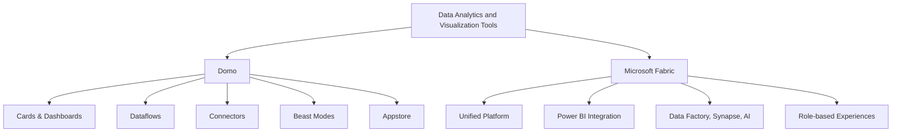

# From Domo to Microsoft Fabric - Overview

Costa Rica

[brown9804](https://github.com/brown9804)

Last updated: 2025-06-24

------------------------------------------

<b>List of References</b> (Click to expand)

- [Microsoft Fabric documentation](https://learn.microsoft.com/en-us/fabric/)
- [Domo Official Site](https://www.domo.com/)
- [Dataflows in Microsoft Fabric](https://learn.microsoft.com/en-us/power-bi/transform-model/dataflows/dataflows-introduction-self-service)
- [Data modeling in Power BI](https://learn.microsoft.com/en-us/power-bi/transform-model/desktop-modeling)
- [Time intelligence functions (DAX)](https://learn.microsoft.com/en-us/dax/time-intelligence-functions-dax)
- [Star schema guidance](https://learn.microsoft.com/en-us/power-bi/guidance/star-schema)
- [Conditional formatting in Power BI](https://learn.microsoft.com/en-us/power-bi/create-reports/desktop-conditional-table-formatting)
- [Optimization guide for Power BI](https://learn.microsoft.com/en-us/power-bi/guidance/power-bi-optimization)
- [Power BI sharing and collaboration](https://learn.microsoft.com/en-us/power-bi/collaborate-share/service-share-dashboards)
- [Power BI governance and administration](https://learn.microsoft.com/en-us/power-bi/guidance/powerbi-implementation-planning-governance)
- [Microsoft Fabric migration guidance](https://learn.microsoft.com/en-us/fabric/get-started/migration-overview)
- [Domo Knowledge Base](https://domo-support.domo.com/s/)

<b>Table of Contents</b> (Click to expand)

- [Overview](#overview)
- [Migration Considerations](#migration-considerations)
- [Lifecycle Comparison](#lifecycle-comparison)
- [Data Ingestion](#data-ingestion)
    - [Essentials for Developers](#essentials-for-developers)
    - [Data Connection Types](#data-connection-types)
- [Data Transformation](#data-transformation)
- [Data Modelling](#data-modelling)
- [How to create visualizations](#how-to-create-visualizations)
    - [Recreate Simple Visuals](#recreate-simple-visuals)
    - [Custom Visuals](#custom-visuals)
    - [Bookmarks and Interactivity](#bookmarks-and-interactivity)
- [Optimization](#optimization)
- [Sharing Platform](#sharing-platform)
- [Admin](#admin)
- [Governance](#governance)
- [Migration Approach](#migration-approach)
    - [How to migrate a report](#how-to-migrate-a-report)
    - [Migrate End Users](#migrate-end-users)

## Overview

| Feature                | Domo                                                                 | Microsoft Fabric                                                                 |
|------------------------|----------------------------------------------------------------------|----------------------------------------------------------------------------------|
| **Data Visualization** | Cards, dashboards, and stories                                       | Power BI for advanced, interactive visualizations                                |
| **Dashboards**         | Drag-and-drop dashboard builder                                      | Unified reporting and dashboard experience                                       |
| **Data Connectivity**  | 1000+ connectors, Domo Workbench                                    | Azure Data Factory, Synapse, Power Query, and more                              |
| **Ease of Use**        | Intuitive UI, Appstore, Magic ETL                                   | SaaS model, low-code/no-code, Power Query                                       |
| **Advanced Analytics** | Beast Modes, Data Science tools, AI/ML apps                         | Built-in AI, DAX, Python/R integration, Copilot                                 |
| **Unified Platform**   | Focused on business intelligence and apps                           | End-to-end analytics: ingestion, transformation, modeling, visualization         |
| **Role-Specific**      | Business users, analysts, IT, data scientists                       | Tailored experiences for engineers, scientists, business users                   |

## Migration Considerations

| Category               | Domo Approach | Microsoft Fabric Approach |
|------------------------|---------------|--------------------------|
| **Data Ingestion**     | Connectors, Workbench, Dataflows | Data Factory, Power Query, Dataflows, Direct Lake |
| **Data Modelling**     | Dataflows, Joins, Beast Modes    | Dataflows, DAX, Star Schema, Relationships        |
| **Visualizations**     | Cards, Stories, Appstore Visuals | Power BI visuals, custom visuals, themes          |
| **Optimization**       | DataFusions, Magic ETL, DataSet Views | Query folding, aggregations, Performance Analyzer |
| **Lifecycle**          | Import, transform, visualize, share | Connect, transform, model, visualize, share      |
| **Sharing & Collaboration** | Groups, Buzz, Appstore, Publication Groups | Workspaces, Apps, Power BI Service, Teams        |
| **Licensing**          | Per user, per instance, enterprise | Per user, Premium, Fabric Capacity               |
| **Governance & Admin** | Admin Center, Data Governance Toolkit | Admin Portal, Sensitivity Labels, Compliance     |
| **End Users**          | Domo University, Community, Support | Microsoft Learn, Community, Support              |
| **Migration Approach** | Manual rebuild, Domo API, export options | Manual rebuild, migration guidance, best practices |

## Lifecycle Comparison

| Stage                  | Prepare (Domo) | Prepare (Fabric) | Visualize (Domo) | Visualize (Fabric) | Share (Domo) | Share (Fabric) |
|------------------------|----------------|------------------|------------------|--------------------|--------------|----------------|
| **Tool**               | Dataflows, Workbench | Data Factory, Power Query | Cards, Stories | Power BI | Buzz, Publication Groups | Workspaces, Apps, Teams |
| **Definition**         | Connect, clean, transform | Connect, clean, transform | Build cards, dashboards | Build reports, dashboards | Share via groups, links | Share via workspaces, apps |

## Data Ingestion

### Essentials for Developers

| Feature                     | Domo | Microsoft Fabric |
|-----------------------------|------|-----------------|
| **Dataflows**               | Yes  | Yes             |
| **Custom Connectors**       | Yes  | Yes             |
| **ETL/ELT**                 | Magic ETL, SQL | Data Factory, Power Query |
| **Scripting**               | Python/R, Beast Modes | Python/R, DAX, M        |
| **Row-Level Security**      | PDP Policies | Row-Level Security (RLS)  |
| **Collaboration**           | Buzz, Groups | Workspaces, Teams         |
| **AI/ML**                   | Domo AI, Appstore | Copilot, AI Insights     |

### Data Connection Types

| Feature         | Domo Import | Domo Federated | Fabric Import | Fabric Direct Lake/Query |
|-----------------|-------------|---------------|---------------|-------------------------|
| **Definition**  | Data imported into Domo | Live query to source | Data imported into Fabric/Power BI | Live query to source or Direct Lake |
| **Performance** | Fast, cached | Depends on source | Fast, cached | Depends on source       |
| **Security**    | PDP (Personalized Data Permissions), Domo security | Source security | RLS (Row-Level Security), Fabric security | Source security         |
| **Offline**     | Yes         | No            | Yes           | No                      |

## Data Transformation

| Feature                | Domo Magic ETL | Power Query Editor (Fabric) |
|------------------------|----------------|----------------------------|
| **Integration**        | Domo platform  | Fabric, Power BI, Excel    |
| **Custom Connectors**  | Yes            | Yes                        |
| **Row/Column Transforms** | Yes         | Yes                        |
| **Parameters**         | Limited        | Yes                        |
| **Scripting**          | Python/R, SQL  | Python/R, M                |
| **Output**             | Datasets, Views| Data model, Excel, Lake    |

## Data Modelling

| **Category**                         | **Comparison**                                                                                                                                      | **Learn More** |
|--------------------------------------|-----------------------------------------------------------------------------------------------------------------------------------------------------|----------------|
| **Dataflows**                        | `Domo Dataflows are similar to Microsoft Fabric Dataflows, enabling reusable ETL logic.`                                                            | [Fabric Dataflows](https://learn.microsoft.com/en-us/power-bi/transform-model/dataflows/dataflows-introduction-self-service) |
| **Date Tables & Time Intelligence**  | `Domo supports date dimensions; Fabric/Power BI recommends dedicated date tables for time intelligence`                                             | [Time intelligence in DAX](https://learn.microsoft.com/en-us/dax/time-intelligence-functions-dax) |
| **Calculations**                     | `Domo Beast Modes ≈ Power BI Calculated Columns/Measures (DAX)`                                                                                     | [DAX basics in Power BI](https://learn.microsoft.com/en-us/power-bi/transform-model/desktop-calculated-columns) |
| **Measures**                         | `Domo Aggregations/Beast Modes ≈ Power BI Measures`                                                                                                 | [Create and use measures in Power BI](https://learn.microsoft.com/en-us/power-bi/transform-model/desktop-measures) |
| **Conditionals**                     | `Domo CASE WHEN ≈ DAX IF/SWITCH.`                                                                                                                   | [DAX IF and SWITCH](https://learn.microsoft.com/en-us/dax/if-function-dax) |
| **Star Schemas**                     | `Domo supports joins; Fabric/Power BI recommends star schema for performance.`                                                                      | [Star schema guidance](https://learn.microsoft.com/en-us/power-bi/guidance/star-schema) |

## How to create visualizations

### Recreate Simple Visuals

| Functionality | Domo | Power BI (Fabric) |
|---------------|------|-------------------|
| Card Builder  | Drag-and-drop | Drag-and-drop, Visualizations pane |
| Appstore      | Custom visuals | Power BI Marketplace               |
| Drill Path    | Drill Path     | Drillthrough, Hierarchies          |
| Filters       | Page/Global    | Slicers, Filters                   |

### Custom Visuals

`Domo Appstore ≈ Power BI Visuals Marketplace`

> Click here to read more about [Custom visuals in Power BI](https://learn.microsoft.com/en-us/power-bi/developer/visuals/develop-power-bi-visuals)

### Bookmarks and Interactivity

`Domo Stories ≈ Power BI Bookmarks, Buttons, and Navigation`

> Click here to read more about [Bookmarks in Power BI](https://learn.microsoft.com/en-us/power-bi/create-reports/desktop-bookmarks)

## Optimization

- Domo: DataFusions, Magic ETL optimization, DataSet Views.
- Fabric: Query folding, aggregations, Performance Analyzer.

> Click here to read more about [Optimization guide for Power BI](https://learn.microsoft.com/en-us/power-bi/guidance/power-bi-optimization)

## Sharing Platform

- Domo: Groups, Buzz, Publication Groups.
- Fabric: Workspaces, Apps, Teams, SharePoint.

> Click here to read more about [Power BI sharing and collaboration](https://learn.microsoft.com/en-us/power-bi/collaborate-share/service-share-dashboards)

## Admin

- Domo: Admin Center, Data Governance Toolkit.
- Fabric: Admin Portal, Sensitivity Labels, Compliance.

> Click here to read more about [Power BI governance and administration](https://learn.microsoft.com/en-us/fabric/admin/)

## Governance

- Domo: PDP, Data Governance Toolkit, Certification.
- Fabric: Sensitivity labels, RLS, workspace management, ALM.

> Click here to read more about [Microsoft Fabric governance](https://learn.microsoft.com/en-us/power-bi/guidance/rls-guidance)

## Migration Approach

> There is no automated tool for migrating from Domo to Microsoft Fabric. Migration requires manual rebuilding of data connections, models, and reports.

### Steps

- **Plan migration**: Inventory Domo cards, dashboards, and dataflows. Prioritize by business value.
- **Proof of Concept**: Test key data sources and visuals in Fabric.
- **Phased migration**: Migrate in stages, starting with critical content.
- **Rebuild data connections**: Use Data Factory, Power Query, or direct connectors.
- **Recreate visuals**: Use Power BI Desktop to rebuild cards and dashboards.
- **Publish and share**: Use Fabric workspaces and apps for distribution.
- **Set up security**: Implement RLS and workspace permissions.
- **Train users**: Provide training and support for end users and developers.
- **Iterate and validate**: Test, gather feedback, and refine.

### How to migrate a report

- Reconnect to data sources in Fabric.
- Rebuild dataflows and transformations.
- Recreate cards and dashboards in Power BI.
- Publish to Fabric workspace.
- Set up RLS and permissions.
- Validate and iterate.

### Migrate End Users

- Communicate migration plan and benefits.
- Provide training and documentation.
- Use phased rollout and support channels.
- Leverage Microsoft Learn and community resources.

  <h3 style="color: #4CAF50;">Total Visitors</h3>
  

