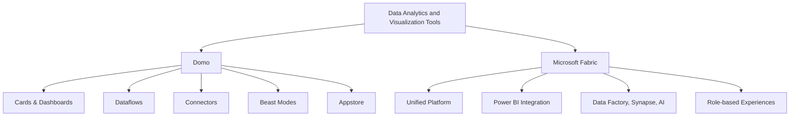

# From Domo to Microsoft Fabric - Overview

Costa Rica

[brown9804](https://github.com/brown9804)

Last updated: 2025-07-17

------------------------------------------

<b>List of References</b> (Click to expand)

- [Microsoft Fabric documentation](https://learn.microsoft.com/en-us/fabric/)
- [Domo Official Site](https://www.domo.com/)
- [Dataflows in Microsoft Fabric](https://learn.microsoft.com/en-us/power-bi/transform-model/dataflows/dataflows-introduction-self-service)
- [Time intelligence functions (DAX)](https://learn.microsoft.com/en-us/dax/time-intelligence-functions-dax)
- [Star schema guidance](https://learn.microsoft.com/en-us/power-bi/guidance/star-schema)
- [Conditional formatting in Power BI](https://learn.microsoft.com/en-us/power-bi/create-reports/desktop-conditional-table-formatting)
- [Optimization guide for Power BI](https://learn.microsoft.com/en-us/power-bi/guidance/power-bi-optimization)
- [Power BI sharing and collaboration](https://learn.microsoft.com/en-us/power-bi/collaborate-share/service-share-dashboards)

<b>Table of Contents</b> (Click to expand)

- [Overview](#overview)
- [Migration Considerations](#migration-considerations)
- [Lifecycle Comparison](#lifecycle-comparison)
- [Data Ingestion](#data-ingestion)
    - [Essentials for Developers](#essentials-for-developers)
    - [Data Connection Types](#data-connection-types)
- [Data Transformation](#data-transformation)
- [Data Modelling](#data-modelling)
- [How to create visualizations](#how-to-create-visualizations)
    - [Recreate Simple Visuals](#recreate-simple-visuals)
    - [Custom Visuals](#custom-visuals)
    - [Bookmarks and Interactivity](#bookmarks-and-interactivity)
- [Optimization](#optimization)
- [Sharing Platform](#sharing-platform)
- [Admin](#admin)
- [Governance](#governance)
- [Migration Approach](#migration-approach)
    - [How to migrate a report](#how-to-migrate-a-report)
    - [Migrate End Users](#migrate-end-users)

## Overview

  

From [Microsoft Documentation](https://learn.microsoft.com/pt-br/fabric/fundamentals/microsoft-fabric-overview)

| Feature                | Domo                                                                 | Microsoft Fabric                                                                 |
|------------------------|----------------------------------------------------------------------|----------------------------------------------------------------------------------|
| **Data Visualization** | Cards, dashboards, and stories                                       | Power BI for advanced, interactive visualizations                                |
| **Dashboards**         | Drag-and-drop dashboard builder                                      | Unified reporting and dashboard experience                                       |
| **Data Connectivity**  | 1000+ connectors, Domo Workbench                                    | Azure Data Factory, Synapse, Power Query, and more                              |
| **Ease of Use**        | Intuitive UI, Appstore, Magic ETL                                   | SaaS model, low-code/no-code, Power Query                                       |
| **Advanced Analytics** | Beast Modes, Data Science tools, AI/ML apps                         | Built-in AI, DAX, Python/R integration, Copilot                                 |
| **Unified Platform**   | Focused on business intelligence and apps                           | End-to-end analytics: ingestion, transformation, modeling, visualization         |
| **Role-Specific**      | Business users, analysts, IT, data scientists                       | Tailored experiences for engineers, scientists, business users                   |

<b>Data Visualization</b> – Click to expand

> Domo uses cards, dashboards, and stories for visualizations. Microsoft Fabric leverages Power BI for advanced, interactive, and customizable visuals.

- **Benefits:** Power BI supports rich interactivity, custom visuals, and AI-driven insights. 
- **Differentiators:** Power BI integrates with DAX, Copilot, and supports embedding in apps and portals. 
- **Use Cases:** Executive dashboards, operational reporting, embedded analytics. 
- **Related Tools:** Power BI Desktop, Power BI Service, Visuals Marketplace. 

<b>Dashboards</b> – Click to expand

> Domo provides a drag-and-drop dashboard builder. Fabric offers a unified reporting and dashboard experience through Power BI.

- **Benefits:** Power BI dashboards aggregate visuals from multiple reports and datasets. 
- **Differentiators:** Supports live tiles, cross-report pinning, and integration with Teams and SharePoint. 
- **Use Cases:** Real-time monitoring, cross-functional reporting, executive summaries. 
- **Related Tools:** Power BI Apps, Power BI Service, Microsoft Teams. 

<b>Data Connectivity</b> – Click to expand

> Domo supports 1000+ connectors and Workbench. Fabric uses Azure Data Factory, Synapse, and Power Query for scalable, enterprise-grade connectivity.

- **Benefits:** Enables hybrid data access, real-time ingestion, and lakehouse integration. 
- **Differentiators:** Native support for Direct Lake, Delta Lake, and Parquet formats. 
- **Use Cases:** ETL/ELT pipelines, streaming data, hybrid cloud access. 
- **Related Tools:** Azure Data Factory, Power Query, Synapse Pipelines, OneLake. 

<b> Domo Workbench & Fabric (Pull/Push) </b> – Click to expand

> In most modern data architectures, the `standard approach is to pull data from input sources into the analytics or ETL platform`.
> Data is typically extracted from source systems using scheduled or event-driven pull methods, where the analytics or ETL platform manages and initiates the data ingestion process.

- **Domo Workbench** operates differently, it’s a **push-based tool** that runs on-premise and sends data directly to Domo.
- **Microsoft Fabric**, is primarily **pull-based**, but it can simulate push behavior. This flexibility allows Fabric to accommodate both traditional pull workflows and modern push-style integrations when needed.
Through:
    - **Uploading files** to OneLake using APIs, `azcopy`, or automation tools.
    - **Eventstream** for real-time data ingestion.
    - **Triggering pipelines** from external systems using REST APIs or Logic Apps.

<b>Ease of Use</b> – Click to expand

> Domo emphasizes ease with Magic ETL and Appstore. Fabric offers a SaaS model with low-code/no-code experiences via Power Query.

- **Benefits:** Power Query provides a familiar, Excel-like interface for data transformation. 
- **Differentiators:** Unified UX across roles, reusable queries, and parameterization. 
- **Use Cases:** Self-service data prep, rapid prototyping, business user reporting. 
- **Related Tools:** Power Query Editor, Dataflows, Power BI Desktop. 

<b>Advanced Analytics</b> – Click to expand

> Domo includes Beast Modes and AI/ML apps. Fabric integrates built-in AI, DAX, Python/R, and Copilot for advanced analytics.

- **Benefits:** Supports predictive modeling, natural language queries, and embedded AI insights. 
- **Differentiators:** Copilot enables natural language report creation and data exploration. 
- **Use Cases:** Forecasting, anomaly detection, NLP-driven insights, data science collaboration. 
- **Related Tools:** Power BI Copilot, Azure ML, Python/R scripts, DAX Studio. 

<b>Unified Platform</b> – Click to expand

> Domo focuses on business intelligence and apps. Fabric delivers end-to-end analytics from ingestion to visualization in a single platform.

- **Benefits:** Reduces tool sprawl and improves governance and collaboration. 
- **Differentiators:** Combines Power BI, Synapse, Data Factory, and OneLake in one SaaS experience. 
- **Use Cases:** Enterprise data platforms, centralized analytics, cross-functional workflows. 
- **Related Tools:** Microsoft Fabric, OneLake, Synapse Data Warehouse, Data Factory. 

<b>Role-Specific Experiences</b> – Click to expand

> Domo supports business users, analysts, and data scientists. Fabric offers tailored experiences for engineers, scientists, and business users.

- **Benefits:** Each role gets a customized interface and toolset, from no-code to pro-code. 
- **Differentiators:** Fabric provides role-based hubs (e.g., Data Engineering, Data Science, BI) within a single platform. 
- **Use Cases:** Data engineering pipelines, BI reporting, data science notebooks, business dashboards. 
- **Related Tools:** Fabric Experiences (BI, Data Engineering, Data Science), Power BI, Notebooks, Pipelines. 

## Migration Considerations

| Category               | Domo Approach | Microsoft Fabric Approach |
|------------------------|---------------|--------------------------|
| **Data Ingestion**     | Connectors, Workbench, Dataflows | Data Factory, Power Query, Dataflows, Direct Lake |
| **Data Modelling**     | Dataflows, Joins, Beast Modes    | Dataflows, DAX, Star Schema, Relationships        |
| **Visualizations**     | Cards, Stories, Appstore Visuals | Power BI visuals, custom visuals, themes          |
| **Optimization**       | DataFusions, Magic ETL, DataSet Views | Query folding, aggregations, Performance Analyzer |
| **Lifecycle**          | Import, transform, visualize, share | Connect, transform, model, visualize, share      |
| **Sharing & Collaboration** | Groups, Buzz, Appstore, Publication Groups | Workspaces, Apps, Power BI Service, Teams        |
| **Licensing**          | Per user, per instance, enterprise | Per user, Premium, Fabric Capacity               |
| **Governance & Admin** | Admin Center, Data Governance Toolkit | Admin Portal, Sensitivity Labels, Compliance     |
| **End Users**          | Domo University, Community, Support | Microsoft Learn, Community, Support              |
| **Migration Approach** | Manual rebuild, Domo API, export options | Manual rebuild, migration guidance, best practices |

<b>Data Ingestion</b> – Click to expand

> Domo uses connectors, Workbench, and Dataflows for ingestion. Microsoft Fabric supports ingestion via Data Factory, Power Query, Dataflows, and Direct Lake.

- **Benefits:** Fabric enables scalable, hybrid ingestion with support for real-time and batch pipelines. 
- **Differentiators:** Direct Lake allows high-performance access to data in OneLake without import or duplication. 
- **Use Cases:** Streaming data, hybrid cloud ingestion, enterprise ETL/ELT pipelines. 
- **Related Tools:** Azure Data Factory, Power Query, Synapse Pipelines, OneLake. 

<b>Data Modelling</b> – Click to expand

> Domo uses Dataflows, Joins, and Beast Modes. Fabric supports Dataflows, DAX, Star Schema, and Relationships for robust modeling.

- **Benefits:** Fabric promotes reusable, scalable models with semantic layers and time intelligence. 
- **Differentiators:** DAX enables complex calculations, and star schema improves performance and maintainability. 
- **Use Cases:** Enterprise semantic models, KPI dashboards, time-based analytics. 
- **Related Tools:** Power BI Desktop, DAX Studio, Dataflows, Tabular Editor. 

<b>Visualizations</b> – Click to expand

> Domo offers Cards, Stories, and Appstore Visuals. Fabric uses Power BI visuals, custom visuals, and themes for rich reporting.

- **Benefits:** Power BI supports interactive visuals, drillthrough, bookmarks, and custom themes. 
- **Differentiators:** Power BI Visuals Marketplace allows importing or developing custom visuals. 
- **Use Cases:** Executive dashboards, operational reports, embedded analytics. 
- **Related Tools:** Power BI Desktop, Visuals Marketplace, Report Builder. 

<b>Optimization</b> – Click to expand

> Domo uses DataFusions, Magic ETL, and DataSet Views. Fabric optimizes with query folding, aggregations, and Performance Analyzer.

- **Benefits:** Fabric enables performance tuning at the query and model level. 
- **Differentiators:** Query folding pushes transformations to the source, reducing load times. 
- **Use Cases:** Large datasets, complex models, performance-critical dashboards. 
- **Related Tools:** Performance Analyzer, DAX Studio, Power BI Optimizer. 

<b>Lifecycle</b> – Click to expand

> Domo follows a lifecycle of import, transform, visualize, and share. Fabric extends this with connect, transform, model, visualize, and share.

- **Benefits:** Fabric supports a more modular and governed lifecycle with reusable components. 
- **Differentiators:** Modeling is a distinct phase, enabling semantic consistency and reuse. 
- **Use Cases:** Enterprise BI workflows, governed self-service analytics. 
- **Related Tools:** Power BI Desktop, Dataflows, Deployment Pipelines. 

<b>Sharing & Collaboration</b> – Click to expand

> Domo uses Groups, Buzz, Appstore, and Publication Groups. Fabric enables collaboration via Workspaces, Apps, Power BI Service, and Teams.

- **Benefits:** Fabric integrates with Microsoft 365 for seamless sharing and collaboration. 
- **Differentiators:** Power BI Apps allow packaging and distributing reports across audiences. 
- **Use Cases:** Cross-team collaboration, secure sharing, embedded analytics. 
- **Related Tools:** Power BI Service, Microsoft Teams, SharePoint, OneDrive. 

<b>Licensing</b> – Click to expand

> Domo offers per user, per instance, and enterprise licensing. Fabric supports per user, Premium, and Fabric Capacity models.

- **Benefits:** Fabric offers flexible scaling with capacity-based pricing for enterprise workloads. 
- **Differentiators:** Fabric Capacity allows shared resources across services like Power BI, Synapse, and Data Factory. 
- **Use Cases:** Small teams to large enterprises, cost-optimized scaling. 
- **Related Tools:** Microsoft 365 Admin Center, Fabric Capacity Metrics App. 

<b>Governance & Admin</b> – Click to expand

> Domo provides Admin Center and Data Governance Toolkit. Fabric includes Admin Portal, Sensitivity Labels, and Compliance tools.

- **Benefits:** Fabric supports enterprise-grade governance with audit logs, data classification, and policy enforcement. 
- **Differentiators:** Integration with Microsoft Purview and Microsoft 365 compliance center. 
- **Use Cases:** Regulated industries, data protection, audit readiness. 
- **Related Tools:** Admin Portal, Microsoft Purview, Power BI Audit Logs. 

<b>End Users</b> – Click to expand

> Domo supports users through Domo University, Community, and Support. Fabric offers Microsoft Learn, Community, and Support resources.

- **Benefits:** Microsoft Learn provides structured, role-based learning paths and certifications. 
- **Differentiators:** Deep integration with Microsoft ecosystem and global community support. 
- **Use Cases:** Onboarding, upskilling, certification, community-driven learning. 
- **Related Tools:** Microsoft Learn, Power BI Community, Fabric Documentation. 

<b>Migration Approach</b> – Click to expand

> Domo migration involves manual rebuilds, Domo API, and export options. Fabric migration also requires manual rebuilds, guided by best practices.

- **Benefits:** Fabric provides structured migration guidance and tooling for rebuilding reports and models. 
- **Differentiators:** Fabric supports Git integration and deployment pipelines for managing migrated content. 
- **Use Cases:** BI modernization, platform consolidation, phased migration strategies. 
- **Related Tools:** Power BI Desktop, Deployment Pipelines, Migration Playbooks. 

## Lifecycle Comparison

| Stage                  | Prepare (Domo) | Prepare (Fabric) | Visualize (Domo) | Visualize (Fabric) | Share (Domo) | Share (Fabric) |
|------------------------|----------------|------------------|------------------|--------------------|--------------|----------------|
| **Tool**               | Dataflows, Workbench | Data Factory, Power Query | Cards, Stories | Power BI | Buzz, Publication Groups | Workspaces, Apps, Teams |
| **Definition**         | Connect, clean, transform | Connect, clean, transform | Build cards, dashboards | Build reports, dashboards | Share via groups, links | Share via workspaces, apps |

<b>Prepare Stage</b> – Click to expand

> In Domo, preparation is done using Dataflows and Workbench. In Microsoft Fabric, preparation is handled through Data Factory and Power Query.

- **Benefits:** Fabric supports both low-code (Power Query) and pro-code (Data Factory) for data preparation. 
- **Differentiators:** Fabric enables scalable, reusable pipelines with support for parameterization, scheduling, and monitoring. 
- **Use Cases:** Data cleansing, transformation, ingestion from multiple sources, scheduled refreshes. 
- **Tools (Domo):** Dataflows, Workbench. 
- **Tools (Fabric):** Power Query, Data Factory, Dataflows. 
- **Definition:** Connect to data sources, clean and transform data for modeling and visualization. 

<b>Visualize Stage</b> – Click to expand

> Domo uses Cards and Stories for visualization. Fabric uses Power BI to build interactive reports and dashboards.

- **Benefits:** Power BI supports advanced visuals, interactivity, and AI-driven insights. 
- **Differentiators:** Power BI allows drillthrough, bookmarks, custom visuals, and integration with Copilot for natural language insights. 
- **Use Cases:** KPI dashboards, operational reports, executive summaries, embedded analytics. 
- **Tools (Domo):** Cards, Stories. 
- **Tools (Fabric):** Power BI Desktop, Power BI Service. 
- **Definition:** Build visual representations of data to support decision-making and storytelling. 

<b>Share Stage</b> – Click to expand

> Domo shares content via Buzz, Publication Groups, and links. Fabric uses Workspaces, Apps, and Microsoft Teams for sharing and collaboration.

- **Benefits:** Fabric integrates with Microsoft 365, enabling seamless sharing, collaboration, and governance. 
- **Differentiators:** Power BI Apps allow packaging and distributing content to different audiences with role-based access. 
- **Use Cases:** Cross-team collaboration, secure sharing, enterprise distribution, embedded reporting. 
- **Tools (Domo):** Buzz, Publication Groups. 
- **Tools (Fabric):** Workspaces, Apps, Teams, SharePoint. 
- **Definition:** Distribute reports and dashboards to stakeholders through secure, scalable channels. 

## Data Ingestion

### Essentials for Developers

| Feature                     | Domo | Microsoft Fabric |
|-----------------------------|------|-----------------|
| **Dataflows**               | Yes  | Yes             |
| **Custom Connectors**       | Yes  | Yes             |
| **ETL/ELT**                 | Magic ETL, SQL | Data Factory, Power Query |
| **Scripting**               | Python/R, Beast Modes | Python/R, DAX, M        |
| **Row-Level Security**      | PDP Policies | Row-Level Security (RLS)  |
| **Collaboration**           | Buzz, Groups | Workspaces, Teams         |
| **AI/ML**                   | Domo AI, Appstore | Copilot, AI Insights     |

<b>Dataflows</b> – Click to expand

> Both Domo and Microsoft Fabric support Dataflows for reusable ETL logic and data transformation.

- **Benefits:** Enables modular, reusable data preparation across multiple reports or datasets. 
- **Differentiators:** Fabric Dataflows integrate with Power BI, Excel, and OneLake, and support parameterization and incremental refresh. 
- **Use Cases:** Shared transformation logic, centralized data prep, multi-report consistency. 
- **Related Tools:** Power BI Dataflows, Power Query, OneLake. 

<b>Custom Connectors</b> – Click to expand

> Both platforms support building custom connectors to integrate with non-native or proprietary data sources.

- **Benefits:** Extends platform capabilities to connect with any API or data service. 
- **Differentiators:** Fabric supports custom connectors via Power Query SDK and M language, with Git-based development workflows. 
- **Use Cases:** Connecting to internal APIs, legacy systems, or third-party services. 
- **Related Tools:** Power Query SDK, Visual Studio Code, GitHub. 

<b>ETL/ELT</b> – Click to expand

> Domo uses Magic ETL and SQL for data transformation. Fabric uses Data Factory and Power Query for ETL/ELT processes.

- **Benefits:** Fabric supports both visual and code-based pipelines, with scheduling, monitoring, and parameterization. 
- **Differentiators:** Data Factory enables scalable, enterprise-grade ELT with integration across Azure services. 
- **Use Cases:** Batch processing, data lake ingestion, transformation pipelines. 
- **Related Tools:** Azure Data Factory, Power Query, Synapse Pipelines. 

<b>Scripting</b> – Click to expand

> Domo supports Python/R and Beast Modes. Fabric supports Python/R, DAX, and M for scripting and calculations.

- **Benefits:** Fabric allows advanced analytics, custom calculations, and automation using multiple scripting languages. 
- **Differentiators:** DAX enables powerful, in-memory calculations; M is used for data transformation in Power Query. 
- **Use Cases:** Custom KPIs, statistical modeling, data transformation, automation. 
- **Related Tools:** Power BI Desktop, DAX Studio, Power Query Editor, Notebooks. 

<b>Row-Level Security</b> – Click to expand

> Domo uses PDP (Personalized Data Permissions). Fabric uses Row-Level Security (RLS) to restrict data access.

- **Benefits:** Ensures users only see data relevant to their role or region. 
- **Differentiators:** Fabric RLS integrates with Azure AD and supports dynamic security rules using DAX. 
- **Use Cases:** Multi-tenant reporting, departmental dashboards, compliance-driven access control. 
- **Related Tools:** Power BI Desktop, RLS Roles, Azure AD Groups. 

<b>Collaboration</b> – Click to expand

> Domo uses Buzz and Groups for collaboration. Fabric uses Workspaces and Microsoft Teams for integrated collaboration.

- **Benefits:** Fabric enables real-time collaboration, commenting, and sharing within Microsoft 365 tools. 
- **Differentiators:** Deep integration with Teams, SharePoint, and OneDrive for seamless collaboration. 
- **Use Cases:** Team-based report development, feedback loops, shared workspaces. 
- **Related Tools:** Power BI Workspaces, Microsoft Teams, SharePoint. 

<b>AI/ML</b> – Click to expand

> Domo offers Domo AI and Appstore ML tools. Fabric includes Copilot, AI Insights, and integration with Azure ML.

- **Benefits:** Fabric enables natural language querying, automated insights, and integration with enterprise ML models. 
- **Differentiators:** Copilot in Power BI allows users to generate visuals and insights using natural language. 
- **Use Cases:** Predictive analytics, anomaly detection, AI-assisted reporting. 
- **Related Tools:** Power BI Copilot, Azure Machine Learning, AI Insights, Python/R Notebooks. 

### Data Connection Types

| Feature         | Domo Import | Domo Federated | Fabric Import | Fabric Direct Lake/Query |
|-----------------|-------------|---------------|---------------|-------------------------|
| **Definition**  | Data imported into Domo | Live query to source | Data imported into Fabric/Power BI | Live query to source or Direct Lake |
| **Performance** | Fast, cached | Depends on source | Fast, cached | Depends on source       |
| **Security**    | PDP (Personalized Data Permissions), Domo security | Source security | RLS (Row-Level Security), Fabric security | Source security         |
| **Offline**     | Yes         | No            | Yes           | No                      |

<b>Domo Import</b> – Click to expand

> Data is imported into Domo and stored in its internal data engine for processing and visualization.

- **Performance:** Fast and cached, optimized for quick access and rendering. 
- **Security:** Governed by Domo’s PDP (Personalized Data Permissions) and internal security model. 
- **Offline Access:** Supported, as data is stored within Domo’s environment. 
- **Use Cases:** Dashboards requiring high performance, offline access, or frequent reuse. 
- **Related Tools:** Domo Workbench, Magic ETL, Dataflows. 

<b>Domo Federated</b> – Click to expand

> Live query connection to the source system without importing data into Domo.

- **Performance:** Depends on the source system’s responsiveness and network latency. 
- **Security:** Inherits security from the source system; no data is stored in Domo. 
- **Offline Access:** Not supported, as data is queried in real time. 
- **Use Cases:** Real-time dashboards, sensitive data that shouldn’t be stored in Domo. 
- **Related Tools:** Federated connectors, Domo Federated Query Engine. 

<b>Fabric Import</b> – Click to expand

> Data is imported into Microsoft Fabric or Power BI and stored in the VertiPaq engine for high-performance analytics.

- **Performance:** Fast and cached; optimized for in-memory querying and compression. 
- **Security:** Governed by Row-Level Security (RLS) and Fabric’s workspace-level permissions. 
- **Offline Access:** Supported, as data is stored within the Fabric environment. 
- **Use Cases:** High-performance dashboards, offline reporting, reusable datasets. 
- **Related Tools:** Power BI Desktop, Dataflows, OneLake, DAX. 

<b>Fabric Direct Lake / Direct Query</b> – Click to expand

> Live query to the source system or Direct Lake access to data stored in OneLake without importing.

- **Performance:** Depends on the source system or lakehouse performance; Direct Lake offers near-import speed. 
- **Security:** Inherits source system security; supports RLS and Azure AD-based access control. 
- **Offline Access:** Not supported, as data is queried in real time. 
- **Use Cases:** Real-time analytics, large datasets, lakehouse architecture, sensitive data. 
- **Related Tools:** Direct Lake, Synapse Lakehouse, Power BI, OneLake. 

## Data Transformation

| Feature                | Domo Magic ETL | Power Query Editor (Fabric) |
|------------------------|----------------|----------------------------|
| **Integration**        | Domo platform  | Fabric, Power BI, Excel    |
| **Custom Connectors**  | Yes            | Yes                        |
| **Row/Column Transforms** | Yes         | Yes                        |
| **Parameters**         | Limited        | Yes                        |
| **Scripting**          | Python/R, SQL  | Python/R, M                |
| **Output**             | Datasets, Views| Data model, Excel, Lake    |

## Data Modelling

| **Category**                         | **Comparison**                                                                                                                                      | **Learn More** |
|--------------------------------------|-----------------------------------------------------------------------------------------------------------------------------------------------------|----------------|
| **Dataflows**                        | `Domo Dataflows are similar to Microsoft Fabric Dataflows, enabling reusable ETL logic.`                                                            | [Fabric Dataflows](https://learn.microsoft.com/en-us/power-bi/transform-model/dataflows/dataflows-introduction-self-service) |
| **Date Tables & Time Intelligence**  | `Domo supports date dimensions; Fabric/Power BI recommends dedicated date tables for time intelligence`                                             | [Time intelligence in DAX](https://learn.microsoft.com/en-us/dax/time-intelligence-functions-dax) |
| **Calculations**                     | `Domo Beast Modes ≈ Power BI Calculated Columns/Measures (DAX)`                                                                                     | [DAX basics in Power BI](https://learn.microsoft.com/en-us/power-bi/transform-model/desktop-calculated-columns) |
| **Measures**                         | `Domo Aggregations/Beast Modes ≈ Power BI Measures`                                                                                                 | [Create and use measures in Power BI](https://learn.microsoft.com/en-us/power-bi/transform-model/desktop-measures) |
| **Conditionals**                     | `Domo CASE WHEN ≈ DAX IF/SWITCH.`                                                                                                                   | [DAX IF and SWITCH](https://learn.microsoft.com/en-us/dax/if-function-dax) |
| **Star Schemas**                     | `Domo supports joins; Fabric/Power BI recommends star schema for performance.`                                                                      | [Star schema guidance](https://learn.microsoft.com/en-us/power-bi/guidance/star-schema) |

<b>Dataflows</b> – Click to expand

> Domo Dataflows and Microsoft Fabric Dataflows both enable reusable ETL logic, but they differ significantly in architecture and flexibility.

- In Domo, Dataflows are built using Magic ETL or SQL-based transformations and are tightly coupled with Domo’s internal data engine. In Microsoft Fabric, Dataflows are built using Power Query (M language) and can output to OneLake, Power BI datasets, or Excel. Fabric Dataflows are modular, support parameterization, and can be scheduled or triggered via APIs.
- **Execution Model:** Fabric Dataflows execute in the Power Query engine, which supports query folding—pushing transformations back to the source system when possible, improving performance and reducing data movement.
- **Reusability:** Fabric Dataflows can be reused across multiple datasets and reports, and can be version-controlled via Git integration.
- **Use Cases:** Centralized transformation logic, shared business rules, multi-report consistency, and integration with lakehouse architecture.
- **Developer Considerations:** Fabric Dataflows support advanced transformations, error handling, and incremental refresh, making them suitable for enterprise-scale ETL pipelines.

<b>Date Tables & Time Intelligence</b> – Click to expand

> Domo supports date dimensions, but Microsoft Fabric (via Power BI) requires explicitly defined date tables for time intelligence functions to work correctly.

- Power BI’s DAX engine relies on a properly related date table to enable time intelligence functions like YTD, QTD, MTD, and rolling averages. These functions use the date table to understand calendar logic and apply filters dynamically.
- **Best Practices:** The date table should be marked as a "Date Table" in Power BI and must have a continuous range of dates with no gaps. It should be related to fact tables via a single-column relationship.
- **Performance Implications:** Using a dedicated date table improves query performance and ensures consistent behavior across measures and visuals.
- **Use Cases:** Financial reporting, fiscal calendars, trend analysis, and forecasting.
- **Developer Considerations:**  Developers should create reusable date tables with calculated columns for year, quarter, month, week, and fiscal periods. These can be stored in shared datasets or templates.

<b>Calculations</b> – Click to expand

> Domo’s Beast Modes are similar to Power BI’s calculated columns and measures, but DAX offers more advanced and optimized calculation capabilities.

- Beast Modes are SQL-like expressions applied at the visualization layer. In Power BI, calculated columns are evaluated during data refresh and stored in the model, while measures are evaluated at query time and are context-sensitive.
- **Engine Behavior:** Calculated columns increase model size but are useful for row-level logic. Measures are more efficient and preferred for aggregations and dynamic calculations.
- **Expression Language:** DAX (Data Analysis Expressions) is a functional language optimized for in-memory analytics. It supports filter context, row context, and advanced functions like CALCULATE, FILTER, and ALL.
- **Use Cases:** Derived fields, conditional logic, dynamic KPIs, and context-aware metrics.
- **Developer Considerations:** Use calculated columns sparingly to avoid bloating the model. Prefer measures for performance and flexibility. Leverage tools like DAX Studio for debugging and optimization.

<b>Measures</b> – Click to expand

> Domo’s aggregations and Beast Modes are functionally similar to Power BI measures, but Fabric’s DAX measures are more powerful and efficient.

- Measures in Power BI are evaluated at query time using the current filter and row context. They do not consume storage and are highly optimized by the VertiPaq engine.
- **Performance Model:** Measures leverage columnar storage and in-memory compression, enabling sub-second query performance even on large datasets.
- **Context Awareness:** Measures adapt dynamically to slicers, filters, and visual interactions, making them ideal for interactive dashboards.
- **Use Cases:** Sales totals, profit margins, year-over-year comparisons, dynamic benchmarks.
- **Developer Considerations:** Measures should be modular and reusable. Use variables (`VAR`) to simplify logic and improve readability. Avoid complex nested logic in visuals—keep it in the model.

<b>Conditionals</b> – Click to expand

> Domo uses SQL-style CASE WHEN logic, while Power BI uses DAX functions like IF, SWITCH, and nested expressions for conditional logic.

- DAX conditionals are more expressive and support both scalar and table-returning logic. SWITCH is preferred for multiple conditions, while IF is used for binary logic.
- **Advanced Logic:** DAX allows combining conditionals with CALCULATE, FILTER, and other functions to create dynamic, context-aware expressions.
- **Use Cases:** Conditional formatting, dynamic labels, tiered pricing, segmentation.
- **Developer Considerations:** Use SWITCH for readability when handling multiple conditions. Combine with SELECTEDVALUE or HASONEVALUE for dynamic behavior in visuals.

<b>Star Schemas</b> – Click to expand

> Domo supports joins between datasets, but Microsoft Fabric (via Power BI) strongly recommends using a star schema for performance and maintainability.

- A star schema consists of a central fact table connected to multiple dimension tables via one-to-many relationships. This structure is optimized for the VertiPaq engine.
- **Performance Benefits:** Star schemas reduce ambiguity, improve query folding, and enable efficient compression and indexing.
- **Modeling Best Practices:** Avoid many-to-many relationships and snowflake schemas when possible. Use surrogate keys and ensure clean, unique dimension tables.
- **Use Cases:** Enterprise data models, scalable reporting, semantic layer design.
- **Developer Considerations:** Design models with clarity and performance in mind. Use tools like Tabular Editor to manage relationships, hierarchies, and metadata.

## How to create visualizations

### Recreate Simple Visuals

| Functionality | Domo | Power BI (Fabric) |
|---------------|------|-------------------|
| Card Builder  | Drag-and-drop | Drag-and-drop, Visualizations pane |
| Appstore      | Custom visuals | Power BI Marketplace               |
| Drill Path    | Drill Path     | Drillthrough, Hierarchies          |
| Filters       | Page/Global    | Slicers, Filters                   |

<b>Card Builder</b> – Click to expand

> Domo and Power BI both offer drag-and-drop interfaces for building visuals, but Power BI provides a more granular and extensible visualization experience.

- In Domo, cards are built using a simplified UI with limited customization. Power BI’s Visualizations pane allows users to select from a wide range of visual types, configure fields, and apply formatting, analytics, and interactivity.
- **Customization:** Power BI supports conditional formatting, reference lines, tooltips, and analytics overlays (e.g., trend lines, forecasts).
- **Performance Considerations:** Power BI visuals are rendered using the VertiPaq engine, which optimizes query performance and visual responsiveness.
- **Use Cases:** KPI cards, bar/line charts, tables, matrices, and combo charts.
- **Developer Considerations:**  Use the Fields pane to control data bindings, and the Format pane for styling. Leverage bookmarks and selection panes for layered visual storytelling.

<b>Appstore / Marketplace</b> – Click to expand

> Domo’s Appstore and Power BI’s Visuals Marketplace both offer extensibility through custom visuals, but Power BI provides a more open and developer-friendly ecosystem.

- Power BI custom visuals are built using TypeScript and the Power BI Visuals SDK. They can be imported from the Marketplace or developed in-house and deployed via organizational visuals.
- **Security & Governance:** Power BI supports certified visuals (Microsoft-validated) and organizational visuals (IT-approved), ensuring compliance and trust.
- **Deployment:** Custom visuals can be packaged as `.pbiviz` files and distributed via GitHub, internal portals, or directly uploaded to reports.
- **Use Cases:** Specialized charts (e.g., Sankey, Gantt, Radar), branded visuals, or industry-specific components.
- **Developer Considerations:** Use the Power BI Visuals CLI for development. Test visuals in sandboxed environments and follow accessibility and performance guidelines.

<b>Drill Path</b> – Click to expand

> Domo supports basic drill paths within cards. Power BI offers more advanced drillthrough, drill-down, and hierarchy navigation.

-  Power BI supports three types of drill interactions:
    - **Drill-down:** Navigate within a hierarchy (e.g., Year → Quarter → Month).
    - **Drill-through:** Navigate to a different page with context passed (e.g., click a region to open a detailed region report).
    - **Expand/Collapse:** Inline hierarchy navigation within visuals.
- **Interactivity:** Users can enable or disable drill modes, and visuals can be configured to respond to cross-filtering and highlighting.
- **Use Cases:** Multi-level reporting, detailed analysis, contextual navigation.
- **Developer Considerations:**  Define hierarchies in the model, use drill-through filters on target pages, and design consistent navigation cues for users.

<b>Filters</b> – Click to expand

> Domo supports page-level and global filters. Power BI offers a more flexible filtering system with slicers, visual-level filters, page filters, and report-level filters.

- Power BI’s filter pane allows developers to apply filters at different scopes:
    - **Visual-level:** Affects only one visual.
    - **Page-level:** Affects all visuals on a page.
    - **Report-level:** Affects all pages in the report.
- **Slicers:**  Slicers are visual filter controls that users can interact with. They support single/multi-select, dropdowns, relative date filtering, and sync across pages.
- **Advanced Filtering:**  Power BI supports Top N, relative time, wildcard, and measure-based filtering.
- **Use Cases:**  Interactive dashboards, user-driven exploration, dynamic filtering.
- **Developer Considerations:**  Use synced slicers for consistent filtering across pages. Leverage filter pane customization to guide user behavior and reduce clutter.

### Custom Visuals

`Domo Appstore ≈ Power BI Visuals Marketplace`

> Click here to read more about [Custom visuals in Power BI](https://learn.microsoft.com/en-us/power-bi/developer/visuals/develop-power-bi-visuals)

### Bookmarks and Interactivity

`Domo Stories ≈ Power BI Bookmarks, Buttons, and Navigation`

> Click here to read more about [Bookmarks in Power BI](https://learn.microsoft.com/en-us/power-bi/create-reports/desktop-bookmarks)

## Optimization

- Domo: DataFusions, Magic ETL optimization, DataSet Views.
- Fabric: Query folding, aggregations, Performance Analyzer.

> Click here to read more about [Optimization guide for Power BI](https://learn.microsoft.com/en-us/power-bi/guidance/power-bi-optimization)

## Sharing Platform

- Domo: Groups, Buzz, Publication Groups.
- Fabric: Workspaces, Apps, Teams, SharePoint.

> Click here to read more about [Power BI sharing and collaboration](https://learn.microsoft.com/en-us/power-bi/collaborate-share/service-share-dashboards)

## Admin

- Domo: Admin Center, Data Governance Toolkit.
- Fabric: Admin Portal, Sensitivity Labels, Compliance.

> Click here to read more about [Power BI governance and administration](https://learn.microsoft.com/en-us/fabric/admin/)

## Governance

- Domo: PDP, Data Governance Toolkit, Certification.
- Fabric: Sensitivity labels, RLS, workspace management, ALM.

> Click here to read more about [Microsoft Fabric governance](https://learn.microsoft.com/en-us/power-bi/guidance/rls-guidance)

## Migration Approach

> There is no automated tool for migrating from Domo to Microsoft Fabric. Migration requires manual rebuilding of data connections, models, and reports.

### Steps

- **Plan migration**: Inventory Domo cards, dashboards, and dataflows. Prioritize by business value.
- **Proof of Concept**: Test key data sources and visuals in Fabric.
- **Phased migration**: Migrate in stages, starting with critical content.
- **Rebuild data connections**: Use Data Factory, Power Query, or direct connectors.
- **Recreate visuals**: Use Power BI Desktop to rebuild cards and dashboards.
- **Publish and share**: Use Fabric workspaces and apps for distribution.
- **Set up security**: Implement RLS and workspace permissions.
- **Train users**: Provide training and support for end users and developers.
- **Iterate and validate**: Test, gather feedback, and refine.

### How to migrate a report

- Reconnect to data sources in Fabric.
- Rebuild dataflows and transformations.
- Recreate cards and dashboards in Power BI.
- Publish to Fabric workspace.
- Set up RLS and permissions.
- Validate and iterate.

### Migrate End Users

- Communicate migration plan and benefits.
- Provide training and documentation.
- Use phased rollout and support channels.
- Leverage Microsoft Learn and community resources.

<!-- START BADGE -->

  
  
Refresh Date: 2025-07-18

<!-- END BADGE -->
