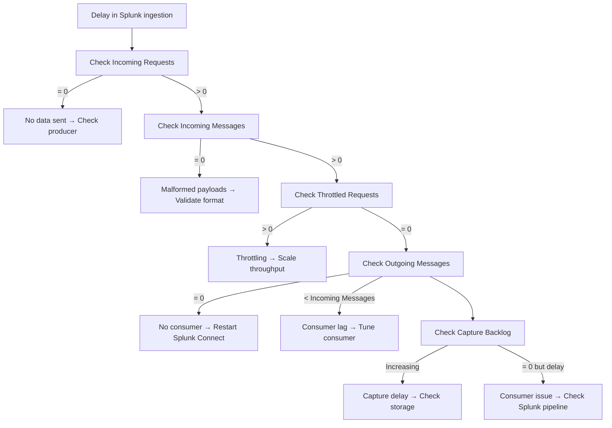

# Azure Event Hubs: Performance Monitoring - Overview 

Costa Rica

 

[brown9804](https://github.com/brown9804)

Last updated: 2025-07-17

----------

<b>List of References</b> (Click to expand)

- [Azure Event Hubs quotas and limits](https://learn.microsoft.com/en-us/azure/event-hubs/event-hubs-quotas#basic-vs-standard-vs-premium-vs-dedicated-tiers)

## Tiers

> Here are list of quotas and limits depending on your Event Hubs tier: [Basic vs. standard vs. premium vs. dedicated tiers](https://learn.microsoft.com/en-us/azure/event-hubs/event-hubs-quotas#basic-vs-standard-vs-premium-vs-dedicated-tiers)

| **Tier**       | **Ingress (Send)**                          | **Egress (Receive)**                         | **Scalability & Notes**                                                                 |
|----------------|---------------------------------------------|----------------------------------------------|------------------------------------------------------------------------------------------|
| **Basic**      | ~1 MB/s or 1,000 events/sec per TU          | ~2 MB/s or 4,096 events/sec per TU           | Max 20 TUs per namespace. No Capture feature. Ideal for small workloads.                |
| **Standard**   | Same as Basic                               | Same as Basic                                | Includes Capture. Max 40 TUs per namespace. Supports scaling via TUs.                   |
| **Premium**    | ~5–10 MB/s ingress per PU                   | ~10–20 MB/s egress per PU                    | Uses Processing Units (PUs). Dedicated resources. Scales by adding PUs.                 |
| **Dedicated**  | Fully customizable (via Capacity Units)     | Fully customizable (via Capacity Units)      | Enterprise-grade. Scales via Capacity Units (CUs). Ideal for massive, mission-critical workloads.|

> [!NOTE]
> - **TU = Throughput Unit** (Basic/Standard): Each `TU gives you ~1 MB/s ingress and ~2 MB/s egress.`
> - **PU = Processing Unit** (Premium): Each PU offers `~5–10 MB/s ingress and ~10–20 MB/s egress depending on partition count and consumer efficiency.`
> - **CU = Capacity Unit** (Dedicated): Custom scaling based on cluster configuration. `You can scale in/out manually or via support ticket.`

E.g 
> If you're ingesting large volumes (e.g., 15 MB/s), you'd need:
- **15 TUs** in Standard tier (if evenly distributed).
- Or **2–3 PUs** in Premium tier for smoother performance and lower cost.

## Monitoring with Metrics

> If you want to spot any gaps or delays in data flow with Azure Event Hubs, it’s a good idea to keep an eye on `some key metrics at each stage of the
> ingestion and consumption process.` These metrics can help you figure out if there’s latency, throttling,
> or data loss happening, whether it’s from the producers, inside Event Hubs, or when data moves to consumers or storage.

https://github.com/user-attachments/assets/2616c7fb-81b5-4365-9346-0332b91cc892

> [!TIP]
> - Incoming Requests → show `how much data is being sent.`
> - Successful Requests → confirm `it's being accepted.`
> - Incoming Messages → count the `actual events received.`
> - Throttled Requests → warn if `you're hitting limits.`
> - Outgoing Messages/Bytes → show `how much is being consumed.`
> - Capture Backlog → reveals if `data is stuck waiting to be stored.`

| **Metric**             | **What It Tells You**                                                                 | **Why It Matters for Delay Diagnosis**                                                                 |
|------------------------|----------------------------------------------------------------------------------------|----------------------------------------------------------------------------------------------------------|
| **Incoming Requests**  | Number of API calls made to send data into Event Hubs.                                | High volume confirms producers are active. If low, delay may be upstream.                               |
| **Successful Requests**| Requests that were accepted and processed by Event Hubs.                              | Confirms Event Hubs is not rejecting traffic. Low values suggest issues with authentication or limits.  |
| **Throttled Requests** | Requests rejected due to throughput or quota limits.                                  | High values indicate Event Hubs is overloaded—can directly cause ingestion delays.                      |
| **Incoming Messages**  | Number of events successfully received by Event Hubs.                                 | Confirms actual data flow. If low despite high requests, payloads may be malformed or dropped.          |
| **Outgoing Messages**  | Number of events read by consumers (e.g., Splunk Connect).                            | If low compared to Incoming Messages, consumers may be lagging, misconfigured, or disconnected.         |
| **Outgoing Bytes**     | Total size of data read by consumers.                                                 | Helps assess payload size and bandwidth. Large payloads may slow delivery even if message count is fine.|
| **Capture Backlog**    | Volume of data waiting to be written to storage (Blob/Data Lake).                     | If using Capture, a growing backlog signals Event Hubs is falling behind or storage is misconfigured.   |

E.g 

https://github.com/user-attachments/assets/e84aee9c-6b2c-47c3-a0bf-0d25f9ecf0e7

<strong>Incoming Requests = 0</strong>

> - `Interpretation`: No data is being sent to Event Hubs. This typically means the upstream producer is inactive, misconfigured, or disconnected.
> - `Why This Matters`: If no requests are arriving, the delay is upstream—not within Event Hubs. This is the first checkpoint in the ingestion pipeline.
> - `Actions to Take`:  
>    - Verify that producers are running and targeting the correct Event Hub.  
>    - Check authentication credentials and network connectivity.  
>    - Review producer logs for errors or dropped messages.  
>    - Ensure DNS resolution and firewall rules allow outbound traffic.

<strong>Incoming Requests > 0 but Incoming Messages = 0</strong>

> - `Interpretation`: Requests are reaching Event Hubs, but no events are being accepted. This may indicate malformed payloads or schema mismatches.
> - `Why This Matters`: Traffic is arriving, but Event Hubs is unable to process it—likely due to formatting or validation issues.
> - `Actions to Take`:  
>    - Validate payload structure and encoding.  
>    - Check for serialization errors or schema mismatches.  
>    - Ensure the producer SDK is compatible with Event Hubs.  
>    - Review Event Hubs logs for dropped or rejected messages.

<strong>Successful Requests < Incoming Requests</strong>

> - `Interpretation`: Some requests are failing—likely due to quota limits, authentication errors, or SDK misconfigurations.
> - `Why This Matters`: Failed requests mean data is not entering the pipeline, which can result in partial ingestion or silent data loss.
> - `Actions to Take`:  
>    - Review Azure Monitor logs for error codes.  
>    - Check Event Hubs quota limits and authentication credentials.  
>    - Ensure the SDK is up to date and properly configured.  
>    - Monitor retry logic and backoff settings.

<strong>Throttled Requests > 0</strong>

> - `Interpretation`: Event Hubs is rejecting requests due to throughput limits being exceeded.
> - `Why This Matters`: Throttling causes ingestion delays and can lead to dropped messages if retries aren't configured.
> - `Actions to Take`:  
>    - Scale up throughput units (TUs).  
>    - Optimize producer batching and retry logic.  
>    - Consider upgrading to Premium or Dedicated tier.  
>    - Monitor partition distribution to avoid hotspots.

<strong>Incoming Messages > Outgoing Messages</strong>

> - `Interpretation`: Consumers are lagging behind. This could be due to slow processing, misconfiguration, or disconnection.
> - `Why This Matters`: Data accumulates in Event Hubs and delays downstream ingestion. This can lead to increased costs or message expiration.
> - `Actions to Take`:  
>    - Check consumer health and retry settings.  
>    - Monitor partition lag and scale out consumer instances.  
>    - Review consumer logs for processing delays.  
>    - Ensure checkpointing is functioning correctly.

<strong>Outgoing Messages = 0</strong>

> - `Interpretation`: No consumer is reading from Event Hubs. This may indicate a broken connection or inactive consumer.
> - `Why This Matters`: If no one is reading, data will remain in Event Hubs and eventually expire or overflow.
> - `Actions to Take`:  
>    - Restart consumer services and validate connection strings.  
>    - Check logs for authentication or network errors.  
>    - Ensure consumer is subscribed to the correct Event Hub and partitions.  
>    - Confirm that the consumer group is active and not blocked.

<strong>Outgoing Bytes unusually high per message</strong>

> - `Interpretation`: Payloads are large, which may slow down delivery due to bandwidth constraints or inefficient serialization.
> - `Why This Matters`: Large payloads can saturate the egress pipeline and delay consumer processing.
> - `Actions to Take`:  
>    - Compress payloads or reduce message size.  
>    - Use efficient serialization formats.  
>    - Increase consumer capacity or parallelism.  
>    - Monitor egress bandwidth and adjust partitioning strategy.

<strong>Capture Backlog increasing over time</strong>

> - `Interpretation`: Event Hubs is falling behind on writing to Blob Storage or Data Lake.
> - `Why This Matters`: A growing backlog indicates that data is stuck in Event Hubs and not being flushed to storage.
> - `Actions to Take`:  
>    - Check storage account health and write permissions.  
>    - Review capture configuration and partition mapping.  
>    - Monitor Event Hubs throughput and scale if needed.  
>    - Validate that the capture destination is reachable.

<strong>Capture Backlog = 0 but Outgoing Messages still delayed</strong>

> - `Interpretation`: Event Hubs is writing to storage successfully, but consumers are still slow.
> - `Why This Matters`: This isolates the delay to the consumer side, not Event Hubs or storage.
> - `Actions to Take`:  
>    - Investigate consumer performance and ingestion rate.  
>    - Check for downstream bottlenecks or queue saturation.  
>    - Review Splunk Connect logs and retry behavior.

## Support and possible considerations

<strong>Low throughput despite normal metrics</strong>

> - `Interpretation`: Event Hubs may be under-provisioned for your workload.
> - `Why This Matters`: This condition can mask performance issues and lead to inconsistent delivery rates.
> - `Actions to Take`:  
>    - Review throughput unit (TU) allocation.  
>    - Consider scaling up or moving to Premium/Dedicated tier.  
>    - Check partition count and ensure load is evenly distributed.

<strong>Region mismatch between Event Hubs and consumers</strong>

> - `Interpretation`: If Event Hubs and consumers are in different Azure regions, network latency can introduce delays.
> - `Why This Matters`: Cross-region traffic increases latency and can degrade performance.
> - `Actions to Take`:  
>    - Align Event Hubs and consumer services to the same region.  
>    - Use Azure Network Watcher to measure latency.  
>    - Consider ExpressRoute or private endpoints for critical workloads.

<strong>Partition imbalance</strong>

> - `Interpretation`: One partition receives significantly more traffic than others, creating a bottleneck.
> - `Why This Matters`: Uneven partition load can lead to throttling, consumer lag, and inefficient resource usage.
> - `Actions to Take`:  
>    - Use a custom partitioning strategy or round-robin.  
>    - Monitor per-partition metrics.  
>    - Rebalance producers and ensure consumers are evenly distributed.

<strong>Consumer checkpointing is delayed</strong>

> - `Interpretation`: Consumers aren’t checkpointing frequently, which may cause reprocessing or lag.
> - `Why This Matters`: Delayed checkpointing increases latency and can cause duplicate processing.
> - `Actions to Take`:  
>    - Review checkpointing interval and logic.  
>    - Ensure storage used for checkpoints is healthy.  
>    - Monitor EventProcessorClient logs.  
>    - Validate that checkpointing is enabled and functioning.

<strong>Consumer SDK version is outdated</strong>

> - `Interpretation`: Older SDKs may have inefficient polling, retry logic, or lack performance features.
> - `Why This Matters`: Using outdated SDKs can introduce latency and reduce reliability.
> - `Actions to Take`:  
>    - Upgrade to the latest Event Hubs SDK.  
>    - Review changelogs for performance improvements.  
>    - Validate retry and prefetch settings.  
>    - Test ingestion performance after upgrade.

<strong>Capture is enabled but unused</strong>

> - `Interpretation`: Event Hubs Capture is turned on, but the data is not being consumed or stored downstream. This can lead to unnecessary resource usage and potential confusion in diagnostics.
> - `Why This Matters`: Capture consumes throughput and storage resources. If it's enabled but unused, it may affect performance or cost without delivering value.
> - `Actions to Take`:  
>    - Review whether Capture is needed for your workload.  
>    - Disable Capture if it's not actively used for analytics or archival.  
>    - Check storage account configuration to ensure it's not misconfigured or unreachable.  
>    - Monitor Capture metrics to confirm data is being written and accessed.

<!-- START BADGE -->

  
  
Refresh Date: 2026-01-29

<!-- END BADGE -->
